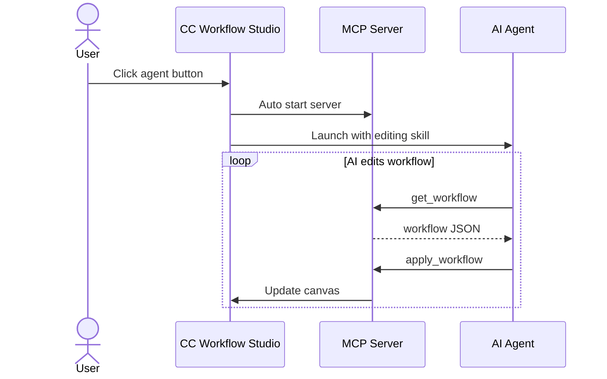

  

# CC Workflow Studio

  
  
  
  
  

  

  <strong>Accelerate Claude Code/GitHub Copilot<a href="#github-copilot-support">(※1)</a>/OpenAI Codex<a href="#openai-codex-support">(※2)</a>/Roo Code<a href="#roo-code-support">(※3)</a> automation with a visual workflow editor</strong>

  Design complex AI agent workflows by conversing with AI – or use intuitive drag-and-drop. Build Sub-Agent orchestrations and conditional branching with natural language, then export directly to <code>.claude</code> format.

<!-- Hero image placeholder - recommended size: 1600x900px or 16:9 aspect ratio -->
<!-- Place image at: /resources/hero.png -->

---

<!-- AI Edit Demo GIF: PR Code Review Workflow -->

  

  <em>✨ Edit with AI: Create a PR code review workflow with MCP, Skills, and conditional branching – All with natural language</em>

---

<!-- Run Workflow Demo GIF -->

  

  <em>▶️ Run workflows directly from the editor – See your AI automation in action instantly</em>

---

## Key Features

🔀 **Visual Workflow Editor** - Intuitive drag-and-drop canvas for designing AI workflows without code

✨ **Edit with AI** - Iteratively improve workflows through conversational AI - ask for changes, add features, or refine logic with natural language feedback

⚡ **One-Click Export & Run** - Export workflows to ready-to-use formats and run directly from the editor:
  - **Claude Code**: `.claude/agents/` and `.claude/commands/`
  - **GitHub Copilot Chat**<a href="#github-copilot-support">(※1)</a>: `.github/prompts/`
  - **GitHub Copilot CLI**<a href="#github-copilot-support">(※1)</a>: `.github/skills/`
  - **OpenAI Codex CLI**<a href="#openai-codex-support">(※2)</a>: `.codex/skills/`
  - **Roo Code**<a href="#roo-code-support">(※3)</a>: `.roo/skills/`

🤖 **GitHub Copilot Support (※1 β)** - Export & Run workflows to Copilot Chat or Copilot CLI, and use Copilot as AI provider for Edit with AI.

  **Note:**
  - Enable **Copilot** option in Toolbar's **More** menu to activate
  - Requires [GitHub Copilot Chat](https://marketplace.visualstudio.com/items?itemName=GitHub.copilot-chat) extension or [Copilot CLI](https://docs.github.com/en/copilot/concepts/agents/about-copilot-cli) to be installed
  - Experimental feature; some workflows may not work as expected

🤖 **OpenAI Codex CLI Support (※2 β)** - Export & Run workflows to Codex CLI (Skills format).

  **Note:**
  - Enable **Codex** option in Toolbar's **More** menu to activate
  - Requires [Codex CLI](https://github.com/openai/codex) to be installed
  - Experimental feature; some workflows may not work as expected

🤖 **Roo Code Support (※3 β)** - Export & Run workflows to Roo Code (Skills format). Run launches Roo Code directly via Extension API.

  **Note:**
  - Enable **Roo Code** option in Toolbar's **More** menu to activate
  - Requires [Roo Code](https://marketplace.visualstudio.com/items?itemName=RooVeterinaryInc.roo-cline) extension to be installed
  - Experimental feature; some workflows may not work as expected

## How to Use

### Launch the Extension

- Click the  icon in the top-right corner of the editor
- Or: Command Palette (`Cmd+Shift+P`) → **"CC Workflow Studio: Open Editor"**

### Create a Workflow

- Add nodes from the palette and configure their settings, or use [Edit with AI](#edit-with-ai).

### Save & Load

- Click Save  button in the toolbar to store your workflow as `.vscode/workflows/*.json`
- Click Load  button in the toolbar to open a saved `.json` workflow

### Export & Run

- Click Export  button in the toolbar to create a `.md` slash command or agent skill (use `/workflow-name` in AI coding agents)
- Click Run  button in the toolbar to run your workflow directly in AI coding agents

### Edit with AI

- Click Edit with AI  button in the toolbar to generate or refine workflows with natural language
- **Native with MCP Server**: Click an AI agent button (Claude Code, Copilot, Codex, Roo Code) in the Edit with AI panel to launch native AI editing. The MCP server starts automatically behind the scenes.

## Usage Examples

Coming soon - Sample workflows and tutorials are under development.

## License

This project is licensed under the **GNU Affero General Public License v3.0** (AGPL-3.0-or-later).

See the [LICENSE](./LICENSE) file for the full license text.

### What this means

- You can use, modify, and distribute this software
- If you modify and deploy this software (including as a network service), you must:
  - Make your modified source code available under AGPL-3.0
  - Provide access to the source code for users interacting with the service
- Commercial use is allowed, but proprietary modifications are not

Copyright (c) 2025 breaking-brake

## Star History

## Acknowledgments

Built with [React Flow](https://reactflow.dev/) • Powered by [Claude Code](https://claude.com/claude-code) • Inspired by [Dify](https://dify.ai/)

---

**Made with CC Workflow Studio**

