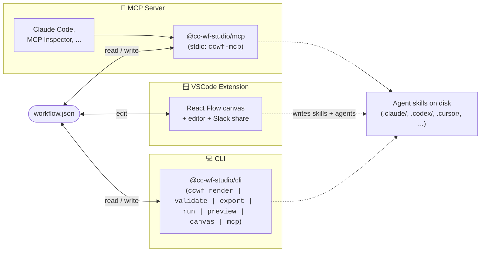
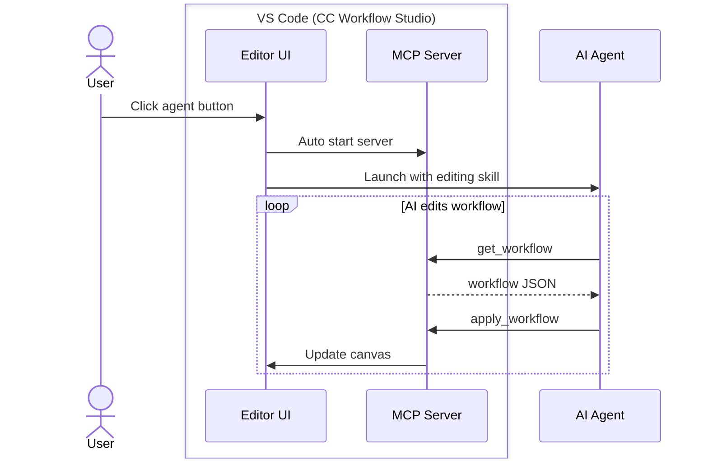

  

# CC Workflow Studio

  
  
  
  
  
  

  

**You think visually. AI thinks in `.md`. CC Workflow Studio speaks both.**

Design workflows on a canvas. Export as Markdown your AI agent already understands. No more prompt-guessing.

  
   
  <em>Why CC Workflow Studio? - Speaker Deck Link</em>

---

## Supported Agents

| Agent | Export Format | Requires |
|-------|--------------|----------|
| Claude Code | `.claude/agents/` `.claude/commands/` | [Claude Code](https://github.com/anthropics/claude-code) |
| GitHub Copilot Chat | `.github/prompts/` | [Copilot Chat](https://marketplace.visualstudio.com/items?itemName=GitHub.copilot-chat) |
| GitHub Copilot CLI | `.github/skills/` | [Copilot CLI](https://github.com/github/copilot-cli) |
| OpenAI Codex CLI | `.codex/skills/` | [Codex CLI](https://github.com/openai/codex) |
| Zoo Code (formerly Roo Code) | `.roo/skills/` | [Zoo Code](https://marketplace.visualstudio.com/items?itemName=ZooCodeOrganization.zoo-code) |
| Gemini CLI | `.gemini/skills/` | [Gemini CLI](https://github.com/google-gemini/gemini-cli) |
| Antigravity | `.agent/skills/` | [Antigravity](https://antigravity.google/) |
| Cursor | `.cursor/agents/` `.cursor/skills/` | [Cursor](https://github.com/cursor/cursor) |

> **Note:** Agents other than Claude Code require activation from Toolbar's **More** menu.

---

## Use it without VSCode, too

The VSCode extension is the most ergonomic editor, but it isn't the only entry point. The same `workflow.json` drives a CLI and an MCP server — pick whichever interface fits the situation.

```mermaid
flowchart LR
    Wf(["workflow.json"])

    subgraph IDE["🪟 VSCode Extension"]
        Canvas["React Flow canvas<br/>+ editor + Slack share"]
    end

    subgraph Mcp["🔌 MCP Server"]
        AIClient["Claude Code,<br/>MCP Inspector, ..."]
        McpServer["@cc-wf-studio/mcp<br/>(stdio: <code>ccwf-mcp</code>)"]
        AIClient --> McpServer
    end

    subgraph Cli["💻 CLI"]
        CliBin["@cc-wf-studio/cli<br/>(<code>ccwf render | validate | export | run | preview | canvas | mcp</code>)"]
    end

    Wf <-->|edit| Canvas
    Wf <-->|read / write| McpServer
    Wf <-->|read / write| CliBin

    Canvas -.->|writes skills + agents| Output["Agent skills on disk<br/>(.claude/, .codex/, .cursor/, ...)"]
    McpServer -.-> Output
    CliBin -.-> Output
```

| Interface | Try it | Best for | Docs |
|---|---|---|---|
| **VSCode extension** | `code --install-extension breaking-brake.cc-wf-studio` | Designing workflows visually | [`packages/vscode`](./packages/vscode/README.md) |
| **CLI (`ccwf`)** | `npx @cc-wf-studio/cli --help` | Terminal / CI / SSH / Codespaces — render, validate, preview, export, run a workflow without VSCode | [`packages/cli`](./packages/cli/README.md) |
| **MCP server (`ccwf-mcp`)** | Add to your MCP client's `.mcp.json` so Claude Code (or any MCP client) can read and edit workflows over stdio | Letting an external AI client read and edit your workflows through MCP tools | [`packages/mcp`](./packages/mcp/README.md) |

There is no "VSCode-only" path: a workflow you draw in the canvas is the same file `ccwf preview` will render in a browser, and the same file an external Claude Code can edit through MCP.

---

<!-- AI Edit Demo GIF: MCP Server-based Workflow Editing -->

  

  <em>✨ Edit with AI: AI agents (Claude Code, GitHub Copilot, etc.) create workflows through natural language via MCP Server</em>

---

<!-- Run Workflow Demo GIF -->

  

  <em>▶️ Run workflows directly from the editor – See your AI automation in action instantly</em>

---

## Key Features

🔀 **Visual Workflow Editor** - Intuitive drag-and-drop canvas for designing AI agent orchestrations without code

🤖 **Agentic Engineering** - Design multi-agent workflows with Sub-Agent orchestration, Agent Skills, and MCP tool integration — the building blocks of agentic engineering

✨ **Edit with AI** - Iteratively improve workflows through conversational AI - ask for changes, add features, or refine logic with natural language feedback

⚡ **One-Click Export & Run** - Export workflows to ready-to-use formats and run directly from the editor

## How to Use

### Launch the Extension

- Click the  icon in the top-right corner of the editor
- Or: Command Palette (`Cmd+Shift+P`) → **"CC Workflow Studio: Open Editor"**

### Create a Workflow

- Add nodes from the palette and configure their settings, or use [Edit with AI](#edit-with-ai).

### Save & Load

- Click Save  button in the toolbar to store your workflow as `.vscode/workflows/*.json`
- Click Load  button in the toolbar to open a saved `.json` workflow

### Export & Run

- Click Export  button in the toolbar to create a `.md` slash command or agent skill (use `/workflow-name` in AI coding agents)
- Click Run  button in the toolbar to run your workflow directly in AI coding agents

### Edit with AI

- Click Edit with AI  button in the toolbar to generate or refine workflows with natural language
- **Native with MCP Server**: Click an AI agent button in the Edit with AI panel to launch native AI editing. The MCP server starts automatically behind the scenes.

```mermaid
sequenceDiagram
    actor User
    box VS Code (CC Workflow Studio)
        participant UI as Editor UI
        participant MCP as MCP Server
    end
    participant Agent as AI Agent

    User->>UI: Click agent button
    UI->>MCP: Auto start server
    UI->>Agent: Launch with editing skill

    loop AI edits workflow
        Agent->>MCP: get_workflow
        MCP-->>Agent: workflow JSON
        Agent->>MCP: apply_workflow
        MCP->>UI: Update canvas
    end
```

## Usage Examples

Coming soon - Sample workflows and tutorials are under development.

## License

The VSCode extension (`cc-wf-studio`) is licensed under the **GNU Affero General Public License v3.0** (AGPL-3.0-or-later).

See the [LICENSE](./LICENSE) file for the full license text.

The reusable libraries published to npm — [`@cc-wf-studio/core`](./packages/core/LICENSE), [`@cc-wf-studio/mcp`](./packages/mcp/LICENSE), and [`@cc-wf-studio/cli`](./packages/cli/LICENSE) — are released under the more permissive **MIT** license. Each package ships its own LICENSE file, which takes precedence for that package.

Copyright (c) 2025 breaking-brake

## Star History

## Acknowledgments

Built with [React Flow](https://reactflow.dev/) • Powered by [Claude Code](https://claude.com/claude-code) • Inspired by [Dify](https://dify.ai/)

---

**Made with CC Workflow Studio**

