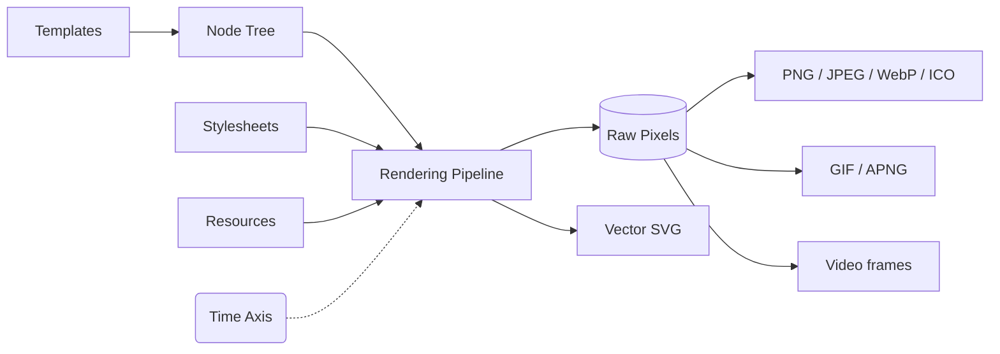

<div align="center">
  

# Takumi

**A Rust rendering engine that turns JSX, HTML, and node trees into images. No headless browser required.**

Render OpenGraph cards, animated GIFs, video frames, and vector SVG from Node.js, Cloudflare Workers, browsers, or any Rust application.
Drop-in compatible with `next/og`.

[](https://www.npmjs.com/package/takumi-js)
[](https://crates.io/crates/takumi)
[](https://www.npmjs.com/package/@takumi-rs/core)
[](#license)

[Documentation](https://takumi.kane.tw/docs/) · [Playground](https://takumi.kane.tw/playground) · [Showcase](https://takumi.kane.tw/showcase)

</div>

## Why Takumi

Takumi is a rendering pipeline built in Rust for one job: turning markup and CSS into pixels. It parses CSS, lays out the tree, shapes text, composites layers, and encodes the output inside a single binary. A headless-Chromium setup spends around 300 MB of RAM and a browser cold start on the same OG card; Takumi spends a function call.

One engine covers every deployment target. Node.js servers load the native binding, Cloudflare Workers and browsers load the WASM build, and Rust applications embed the `takumi` crate. Prebuilt binaries ship for macOS, Linux (glibc and musl), and Windows, on both x64 and ARM64.

The CSS support reaches past the usual OG-image subset: CSS Grid, `::before` and `::after`, `:is()` and `:where()` selectors, masks and `clip-path`, `backdrop-filter`, `background-clip: text`, conic gradients, RTL text, and Tailwind v4 utilities including arbitrary values.

## Quick Start

```bash
bun i takumi-js
```

### Static image

```tsx
import { render } from "takumi-js";
import { writeFile } from "node:fs/promises";

const image = await render(
  <div tw="w-full h-full flex items-center justify-center bg-gradient-to-b from-blue-100 to-red-50">
    <h1 tw="text-6xl font-bold">Hello from Takumi</h1>
  </div>,
  { width: 1200, height: 630 },
);

await writeFile("./output.png", image);
```

### API route (`next/og`-compatible)

```tsx
import { ImageResponse } from "takumi-js/response";

export function GET() {
  return new ImageResponse(
    <div tw="w-full h-full flex items-center justify-center bg-gradient-to-b from-blue-100 to-red-50">
      <h1 tw="text-6xl font-bold">Hello from Takumi</h1>
    </div>,
    { width: 1200, height: 630 },
  );
}
```

### Animated WebP

```tsx
import { renderAnimation } from "takumi-js";
import { writeFile } from "node:fs/promises";

const animation = await renderAnimation({
  width: 400,
  height: 400,
  fps: 30,
  format: "webp",
  scenes: [
    {
      durationMs: 1000,
      node: (
        <div tw="w-full h-full flex items-center justify-center">
          <div tw="w-32 h-32 bg-blue-500 animate-spin rounded-lg" />
        </div>
      ),
    },
  ],
});

await writeFile("./output.webp", animation);
```

### Vector SVG

```tsx
import { renderSvg } from "takumi-js";
import { writeFile } from "node:fs/promises";

const svg = await renderSvg(
  <div tw="w-full h-full flex items-center justify-center bg-gradient-to-b from-blue-100 to-red-50">
    <h1 tw="text-6xl font-bold">Hello from Takumi</h1>
  </div>,
  { width: 1200, height: 630 },
);

await writeFile("./output.svg", svg);
```

### Rust

```bash
cargo add takumi
```

Start from the [Rust example](./example/rust).

## Comparison

| Feature                            | `next/og` (Satori) |                            Takumi                             |
| :--------------------------------- | :----------------: | :-----------------------------------------------------------: |
| **Runtime**                        |    Node / Edge     |        Node, Edge, CF Workers, Browser, **Rust crate**        |
| **Template input**                 |    JSX / React     |     JSX, HTML strings, JSON node trees from any language      |
| **Layout**                         |      Flexbox       |          Flexbox, **CSS Grid**, block, inline, float          |
| **Selectors**                      |      Limited       | Complex selectors, `:is()`, `:where()`, `::before`, `::after` |
| **`backdrop-filter`, blend modes** |         ✗          |                              ✅                               |
| **Animated output**                |         ✗          |             **WebP / APNG / GIF / video frames**              |
| **Vector SVG output**              |     ✅ Native      |            ✅ **Plus raster and animated output**             |
| **Headless browser**               |         ✗          |                               ✗                               |
| **`ImageResponse` API**            |     ✅ Native      |                       ✅ **Compatible**                       |

Compare rendering output across providers at [image-bench.kane.tw](https://image-bench.kane.tw).

## Who's Using Takumi

- [Dcard](https://dcard.tw) renders post share images
- [TanStack](https://tanstack.com) renders OG images for its docs
- [Fumadocs](https://fumadocs.dev) generates its docs OG images
- [Nuxt OG Image](https://nuxtseo.com/docs/og-image/renderers/takumi) ships Takumi as a built-in renderer
- [shiki-image](https://github.com/pi0/shiki-image) turns syntax-highlighted code into images

More projects in the [showcase](https://takumi.kane.tw/showcase). Takumi is part of the [Vercel OSS Program](https://vercel.com/oss).

## Core Architecture

Takumi converts any template into a **node tree** with three node kinds: `container`, `image`, and `text`. That tree runs through:

1. **Layout** via [taffy](https://github.com/DioxusLabs/taffy): Flexbox, Grid, block, float, `calc()`, absolute positioning, z-index
2. **Text shaping** via [parley](https://github.com/linebender/parley) and [skrifa](https://github.com/googlefonts/fontations/tree/main/skrifa): WOFF/WOFF2 fonts, emoji, RTL, multi-span inline blocks
3. **Compositing**: stacking contexts, blend modes, filters, transforms, SVG via [resvg](https://github.com/linebender/resvg)
4. **Output**: PNG, JPEG, WebP, ICO for statics; GIF, APNG, WebP for animations; raw RGBA frames for video pipelines

The input contract is a node tree, so any template system that serializes to HTML or JSON can feed it: React, Svelte, Vue, plain strings, or your own serializer in any language.

A **time axis** threads through the pipeline: the renderer takes a timestamp, so a PNG is the tree at `t=0` and a GIF is the same tree sampled across `t`. CSS `@keyframes`, the `animation` shorthand, and Tailwind animation utilities (`animate-spin`, `animate-bounce`, arbitrary values) all resolve at render time.

The same layout drives a second backend: `renderSvg()` (Rust `render_svg`, behind the `svg-backend` feature) emits a real `<svg>` document built from `<rect>`, `<path>`, gradients, and glyph outlines, so you can ship scalable vector output instead of pixels. If you reached for [satori](https://github.com/vercel/satori) to get SVG, this is the drop-in path.



## Showcase

|                                 Takumi OG image [(source)](./example/twitter-images/components/og-image.tsx)                                 |                Package OG card [(source)](./example/twitter-images/components/package-og-image.tsx)                 |
| :------------------------------------------------------------------------------------------------------------------------------------------: | :-----------------------------------------------------------------------------------------------------------------: |
|                                                                              |                                            |
|                        **Prisma-style API card** [(source)](./example/twitter-images/components/prisma-og-image.tsx)                         |              **X-style social post** [(source)](./example/twitter-images/components/x-post-image.tsx)               |
|                                                                       |                                              |
|                             **Keyframe Animation** [(source)](./example/ffmpeg-keyframe-animation/src/index.tsx)                             |                                **[shiki-image](https://github.com/pi0/shiki-image)**                                |
| [](./example/ffmpeg-keyframe-animation/output/animation.mp4) |  |

**More examples:** [Next.js](./example/nextjs), [Cloudflare Workers](./example/cloudflare-workers), [TanStack Start](./example/tanstack-start), [Svelte](./example/svelte), [Rust](./example/rust), [ffmpeg keyframe animation](./example/ffmpeg-keyframe-animation)

- [(Unofficial) Takumi Playground](https://takumi-playground.kapadiya.net/)

## Contributing

Read [CONTRIBUTING.md](./CONTRIBUTING.md). Covers local setup, test commands, fixture workflow, and changelog process.

We welcome bug reports, feature requests, doc improvements, and new example integrations.

## License

MIT or Apache-2.0

<br/>
<a href="https://vercel.com/oss">
  
</a>

