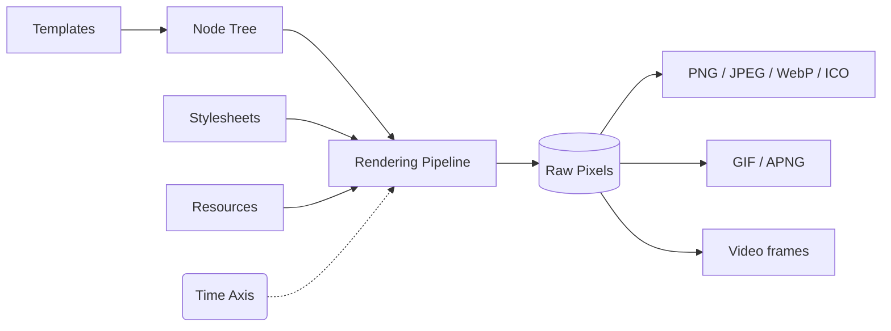

<div align="center">
  

# Takumi

**A Rust rendering engine that turns JSX, HTML, and node trees into images. No headless browser required.**

Render OpenGraph cards, animated GIFs, and video frames at the speed of compiled Rust.
Runs on Node.js, Cloudflare Workers, browsers, or directly as a Rust crate.
Drop-in compatible with `next/og`.

[Documentation](https://takumi.kane.tw/docs/) · [Playground](https://takumi.kane.tw/playground)

</div>

## Why Takumi

Most image-generation solutions are either a headless Chromium instance eating 300 MB of RAM, or a minimal SVG-to-PNG renderer that falls apart the moment you need real CSS. Takumi is neither of those.

It's a purpose-built Rust rendering pipeline: CSS parsing, layout, compositing, image output. No browser, no V8, no puppeteer. The same binary runs in a serverless edge function and a long-running Node.js server, and the same `takumi` crate embeds directly in any Rust application.

## Core Architecture

Takumi converts any template into a **node tree** with three node kinds: `container`, `image`, and `text`. That tree runs through:

1. **Layout** via [taffy](https://github.com/DioxusLabs/taffy): Flexbox, Grid, block, float, `calc()`, absolute positioning, z-index
2. **Text shaping** via [parley](https://github.com/linebender/parley) and [skrifa](https://github.com/googlefonts/fontations/tree/main/skrifa): WOFF/WOFF2 fonts, emoji, RTL, multi-span inline blocks
3. **Compositing**: stacking contexts, blend modes, filters, transforms, SVG via [resvg](https://github.com/linebender/resvg)
4. **Output**: PNG, JPEG, WebP, ICO for statics; GIF, APNG, WebP for animations; raw RGBA frames for video pipelines

Because the input contract is just a node tree, any template system that can serialize to HTML or JSON plugs in without glue code. React, Svelte, Vue, plain strings, or your own serializer in any language.

A **time axis** threads through the pipeline. Animations, GIFs, and video frames are not a separate API. They're the same renderer called at timestamp `t`. CSS `@keyframes`, the `animation` shorthand, and Tailwind animation utilities (`animate-spin`, `animate-bounce`, arbitrary values) all resolve at render time.



## Comparison

| Feature                 | `next/og` (Satori) |                              Takumi                               |
| :---------------------- | :----------------: | :---------------------------------------------------------------: |
| **Runtime**             |    Node / Edge     |          Node, Edge, CF Workers, Browser, **Rust crate**          |
| **Template input**      |    JSX / React     | JSX, HTML strings, JSON node trees, **any language or framework** |
| **CSS subset**          |   Tailwind / CSS   |                       **Tailwind v4 / CSS**                       |
| **Selectors**           |      Limited       |                       **Complex selectors**                       |
| **Animated output**     |         ✗          |               **WebP / APNG / GIF / Video frames**                |
| **Headless browser**    |         ✗          |                                 ✗                                 |
| **`ImageResponse` API** |     ✅ Native      |                         ✅ **Compatible**                         |

## Quick Start

```bash
bun i takumi-js
```

### Static image

```tsx
import { render } from "takumi-js";
import { writeFile } from "node:fs/promises";

const image = await render(
  <div tw="w-full h-full flex items-center justify-center bg-gradient-to-b from-blue-100 to-red-50">
    <h1 tw="text-6xl font-bold">Hello from Takumi</h1>
  </div>,
  { width: 1200, height: 630 },
);

await writeFile("./output.png", image);
```

### API route (`next/og`-compatible)

```tsx
import { ImageResponse } from "takumi-js/response";

export function GET() {
  return new ImageResponse(
    <div tw="w-full h-full flex items-center justify-center bg-gradient-to-b from-blue-100 to-red-50">
      <h1 tw="text-6xl font-bold">Hello from Takumi</h1>
    </div>,
    { width: 1200, height: 630 },
  );
}
```

### Animated WebP

```tsx
import { Renderer } from "takumi-js/node";
import { fromJsx } from "takumi-js/helpers/jsx";
import { writeFile } from "node:fs/promises";

const renderer = new Renderer();

const { node, stylesheets } = await fromJsx(
  <div tw="w-full h-full flex items-center justify-center">
    <div tw="w-32 h-32 bg-blue-500 animate-spin rounded-lg" />
  </div>,
);

const animation = await renderer.renderAnimation({
  width: 400,
  height: 400,
  fps: 30,
  format: "webp",
  stylesheets,
  scenes: [{ durationMs: 1000, node }],
});

await writeFile("./output.webp", animation);
```

## Showcase

|                                 Takumi OG image [(source)](./example/twitter-images/components/og-image.tsx)                                 |                Package OG card [(source)](./example/twitter-images/components/package-og-image.tsx)                 |
| :------------------------------------------------------------------------------------------------------------------------------------------: | :-----------------------------------------------------------------------------------------------------------------: |
|                                                                              |                                            |
|                        **Prisma-style API card** [(source)](./example/twitter-images/components/prisma-og-image.tsx)                         |              **X-style social post** [(source)](./example/twitter-images/components/x-post-image.tsx)               |
|                                                                       |                                              |
|                             **Keyframe Animation** [(source)](./example/ffmpeg-keyframe-animation/src/index.tsx)                             |                                **[shiki-image](https://github.com/pi0/shiki-image)**                                |
| [](./example/ffmpeg-keyframe-animation/output/animation.mp4) |  |

**More examples:** [Next.js](./example/nextjs), [Cloudflare Workers](./example/cloudflare-workers), [TanStack Start](./example/tanstack-start), [Svelte](./example/svelte), [Rust](./example/rust), [ffmpeg keyframe animation](./example/ffmpeg-keyframe-animation)

- [(Unofficial) Takumi Playground](https://takumi-playground.kapadiya.net/)

## Contributing

Read [CONTRIBUTING.md](./CONTRIBUTING.md). Covers local setup, test commands, fixture workflow, and changeset process.

We welcome bug reports, feature requests, doc improvements, and new example integrations.

## License

MIT or Apache-2.0

<br/>
<a href="https://vercel.com/oss">
  
</a>

