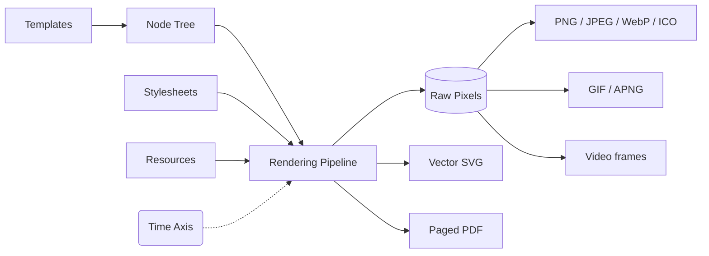

<div align="center">
  

# Takumi

**Render OG images and paged PDFs from JSX, HTML, and CSS. No headless browser.**

Takumi renders images in Node.js, Cloudflare Workers, browsers, and Rust applications. The PDF package runs in Node.js, Bun, and Cloudflare Workers.

[](https://www.npmjs.com/package/takumi-js)
[](https://www.npmjs.com/package/takumi-pdf)
[](https://crates.io/crates/takumi)
[](https://www.npmjs.com/package/@takumi-rs/core)
[](#license)

[Documentation](https://takumi.kane.tw/docs/) · [Playground](https://takumi.kane.tw/playground) · [Showcase](https://takumi.kane.tw/showcase)

</div>

## Quick Start

```bash
bun i takumi-js    # PNG, JPEG, WebP, SVG, animations
bun i takumi-pdf   # paged PDF
```

### Image

```tsx
import { render } from "takumi-js";
import { writeFile } from "node:fs/promises";

const image = await render(
  <div tw="w-full h-full flex items-center justify-center bg-gradient-to-b from-blue-100 to-red-50">
    <h1 tw="text-6xl font-bold">Hello from Takumi</h1>
  </div>,
  { width: 1200, height: 630 },
);

await writeFile("./output.png", image);
```

### PDF

```tsx
import { render } from "takumi-pdf";
import { PageNumber, TotalPages } from "takumi-pdf/primitives";
import { writeFile } from "node:fs/promises";

const pdf = await render(<Invoice data={data} />, {
  size: "a4",
  footer: (
    <div tw="flex w-full justify-center text-[10px] text-gray-500">
      Page <PageNumber /> of <TotalPages />
    </div>
  ),
});

await writeFile("invoice.pdf", pdf);
```

## Features

Takumi is a Rust rendering engine for markup and CSS. It handles layout, text shaping, compositing, and encoding without launching a browser. One component tree renders as an image, an animation, or a paged PDF.

### Images

- **`text-fit`** grows or shrinks a headline to fill its line box, no measuring loop.
- **`text-wrap: balance`** evens multi-line headlines. `pretty` spares the orphan word.
- **Animations** sample the tree across time. `@keyframes` and `animate-spin` become WebP, APNG, GIF, or video frames.
- **Stylesheets** apply as written, with complex selectors, `var()`, `calc()`, and media queries.
- **CSS Grid**, block, inline, and float handle layout.
- **`lang`** picks each language's own Han glyphs for the same code points.
- **Text on a path** follows `offset-path`. `background-clip: text` and conic gradients paint it.
- Masks, `clip-path`, `backdrop-filter`, and blend modes composite the way browsers do.
- **SVG filters** run through `filter: url(...)`, `feTurbulence` and `feDisplacementMap` included.
- **`corner-shape`** swaps round corners for `squircle`, `bevel`, `scoop`, `notch`, or `superellipse(n)`.
- **Tailwind v4** utilities apply directly, arbitrary values included.

### PDF

- **Page breaks** honor `break-before: page`, `break-after: page`, and `break-inside: avoid`.
- **Widows and orphans** default to 2, keeping lone lines away from page breaks.
- **Headers and footers** repeat on every page. `<PageNumber />` and `<TotalPages />` count in CSS counter styles, `trad-chinese-informal` included.
- **Tables** share column widths across pages and repeat their `<thead>` on every page.
- **Text** stays selectable and searchable. Fonts embed as subsets.
- **Links** and metadata carry into the output. `outline: true` builds bookmarks from headings.
- **Attachments** embed files, including Factur-X e-invoice XML.
- **Tagged PDF** is on by default. PDF/A-2, A-3, A-4, and PDF/UA-1 pass veraPDF.
- **Arabic**, bidi text, CJK, and emoji shape correctly.
- **1.5 MB** of gzip wasm fits the Cloudflare Workers free plan.

### Runtimes

- **Node.js and Bun** load a native binding, prebuilt for macOS, Linux (glibc and musl), and Windows on x64 and ARM64.
- **Cloudflare Workers** and browsers load the WebAssembly build.
- **Rust** applications embed the `takumi` crate.

## Coming From Something Else

| You are using                    | What changes                                                                                                                                                                                                |
| :------------------------------- | :---------------------------------------------------------------------------------------------------------------------------------------------------------------------------------------------------------- |
| `satori`                         | Replace `satori()` with `renderSvg()`, or call `render()` for encoded image bytes. [Compare the renderers](https://takumi.kane.tw/docs/comparison-to-satori).                                               |
| `next/og`                        | Swap the `ImageResponse` import. Existing Satori-compatible templates keep their explicit Flexbox styles. [Read the migration guide](https://takumi.kane.tw/docs/comparison-to-satori#migrate-from-nextog). |
| Puppeteer or Playwright for PDFs | Replace `page.pdf()` with `render()`. You must preload remote assets, and Takumi supports less CSS than Chrome. [Read the migration guide](https://takumi.kane.tw/docs/pdf/from-puppeteer).                 |
| `@react-pdf/renderer`            | Replace `Document`, `View`, and `Text` with HTML elements and CSS. Browser viewers and some text controls have no equivalent. [Read the migration guide](https://takumi.kane.tw/docs/pdf/from-react-pdf).   |
| `pdfkit`                         | Use JSX or HTML instead of positioning each line. Keep `pdfkit` when you need low-level drawing control.                                                                                                    |

## More Output

### Fonts

Only a last-resort Latin font ships built in. Load the rest through `fonts`: a URL, raw bytes, or `googleFonts`. A weight range or an `axes` entry loads the variable font, so `font-variation-settings` drives its axes:

```tsx
import { render } from "takumi-js";
import { googleFonts } from "takumi-js/helpers";

const image = await render(
  <div
    tw="w-full h-full flex items-center justify-center"
    style={{
      fontSize: 72,
      fontFamily: "Fraunces",
      fontVariationSettings: "'opsz' 72, 'wght' 700",
    }}
  >
    Hello from Takumi
  </div>,
  {
    width: 1200,
    height: 630,
    fonts: googleFonts([{ name: "Fraunces", weight: "100..900", axes: { opsz: "9..144" } }]),
  },
);
```

Rendering many images? Register the fonts once on a `Renderer` and reuse it. See [Typography & Fonts](https://takumi.kane.tw/docs/typography-and-fonts).

### API route (`next/og`-compatible)

```tsx
import { ImageResponse } from "takumi-js/response";

export function GET() {
  return new ImageResponse(
    <div tw="w-full h-full flex items-center justify-center bg-gradient-to-b from-blue-100 to-red-50">
      <h1 tw="text-6xl font-bold">Hello from Takumi</h1>
    </div>,
    { width: 1200, height: 630 },
  );
}
```

### Animated WebP

```tsx
import { renderAnimation } from "takumi-js";
import { writeFile } from "node:fs/promises";

const animation = await renderAnimation({
  width: 400,
  height: 400,
  fps: 30,
  format: "webp",
  scenes: [
    {
      durationMs: 1000,
      node: (
        <div tw="w-full h-full flex items-center justify-center">
          <div tw="w-32 h-32 bg-blue-500 animate-spin rounded-lg" />
        </div>
      ),
    },
  ],
});

await writeFile("./output.webp", animation);
```

### Vector SVG

```tsx
import { renderSvg } from "takumi-js";
import { writeFile } from "node:fs/promises";

const svg = await renderSvg(
  <div tw="w-full h-full flex items-center justify-center bg-gradient-to-b from-blue-100 to-red-50">
    <h1 tw="text-6xl font-bold">Hello from Takumi</h1>
  </div>,
  { width: 1200, height: 630 },
);

await writeFile("./output.svg", svg);
```

### Rust

```bash
cargo add takumi
```

Start from the [Rust example](./example/rust).

## Comparison

### Images

| Feature                            | `next/og` (Satori) |                            Takumi                             |
| :--------------------------------- | :----------------: | :-----------------------------------------------------------: |
| **Runtime**                        |    Node / Edge     |        Node, Edge, CF Workers, Browser, **Rust crate**        |
| **Template input**                 |    JSX / React     |     JSX, HTML strings, JSON node trees from any language      |
| **Layout**                         |      Flexbox       |          Flexbox, **CSS Grid**, block, inline, float          |
| **Selectors**                      |      Limited       | Complex selectors, `:is()`, `:where()`, `::before`, `::after` |
| **`backdrop-filter`, blend modes** |         ✗          |                              ✅                               |
| **Animated output**                |         ✗          |             **WebP / APNG / GIF / video frames**              |
| **Vector SVG output**              |     ✅ Native      |            ✅ **Plus raster and animated output**             |
| **Headless browser**               |         ✗          |                               ✗                               |
| **`ImageResponse` API**            |     ✅ Native      |                       ✅ **Compatible**                       |

Compare rendering output across providers at [image-bench.kane.tw](https://image-bench.kane.tw).

### PDF

The benchmark uses an 80-line invoice with two pages and a page-number footer. Warm figures are the median of 20 renders. The environment was an Apple M1 Pro with macOS 15.7.4, Bun 1.3.14, and Chrome 151. The [bench source](./example/pdf-bench) reproduces the table.

|                               | takumi-pdf 0.4                              | @react-pdf/renderer 4.5.1                             | Puppeteer + Chrome              |
| :---------------------------- | :------------------------------------------ | :---------------------------------------------------- | :------------------------------ |
| Cold start to first PDF       | 176 ms                                      | 495 ms                                                | 0.7 to 2.8 s                    |
| Warm render (median)          | 26 ms                                       | 236 ms                                                | 198 ms                          |
| Output size                   | 19 KB (15 KB with `tagged: false`)          | 16 KB                                                 | 52 KB                           |
| Deploy needs                  | 1.5 MB gzip wasm                            | pure JS                                               | Chrome install (hundreds of MB) |
| Template language             | JSX, HTML, node trees with CSS and Tailwind | its own primitives (`<View>`, `<Text>`, `StyleSheet`) | HTML with full CSS              |
| Selectable text, subset fonts | yes                                         | yes                                                   | yes                             |
| Arabic and bidi text          | yes                                         | shaping only, manual direction                        | yes                             |
| Runs on edge runtimes         | yes (Cloudflare Workers)                    | no (Node)                                             | no                              |

Chrome has the most complete CSS support of the three. Takumi's PDF output does not support `filter: blur()`, `drop-shadow()`, or `backdrop-filter`. Use Puppeteer when you need to reproduce a complex web page pixel for pixel. See the [PDF comparison](https://takumi.kane.tw/docs/pdf/comparison) for install sizes and more caveats.

## Who's Using Takumi

- [Dcard](https://dcard.tw) renders post share images
- [TanStack](https://tanstack.com) renders OG images for its docs
- [Fumadocs](https://fumadocs.dev) generates its docs OG images
- [Nuxt OG Image](https://nuxtseo.com/docs/og-image/renderers/takumi) ships Takumi as a built-in renderer
- [Luma](https://lu.ma) renders event share images
- [shiki-image](https://github.com/pi0/shiki-image) turns syntax-highlighted code into images

More projects in the [showcase](https://takumi.kane.tw/showcase). Takumi is part of the [Vercel OSS Program](https://vercel.com/oss).

## Core Architecture

Takumi converts any template into a **node tree** with three node kinds: `container`, `image`, and `text`. That tree runs through:

1. **Layout** via [taffy](https://github.com/DioxusLabs/taffy): Flexbox, Grid, block, float, `calc()`, absolute positioning, z-index
2. **Text shaping** via [parley](https://github.com/linebender/parley) and [skrifa](https://github.com/googlefonts/fontations/tree/main/skrifa): WOFF/WOFF2 fonts, emoji, RTL, multi-span inline blocks
3. **Compositing**: stacking contexts, blend modes, filters, transforms, SVG via [resvg](https://github.com/linebender/resvg)
4. **Output**: PNG, JPEG, WebP, ICO for statics; GIF, APNG, WebP for animations; paged PDF; raw RGBA frames for video pipelines

- Any template system that serializes to HTML or JSON can feed the node tree: React, Svelte, Vue, plain strings, or your own serializer in any language.
- A time axis threads through the pipeline. A PNG is the tree at `t=0`. A GIF samples the same tree across `t`. CSS `@keyframes`, the `animation` shorthand, and Tailwind animation utilities resolve at render time.
- The same layout drives two vector backends: `renderSvg()` for Satori-style SVG, `takumi-pdf` for paged PDF.


```mermaid
flowchart LR
    A[Templates] --> N[Node Tree] --> P[Rendering Pipeline]
    C[Stylesheets] --> P
    R[Resources] --> P
    D(Time Axis) -.-> P

    P --> F[(Raw Pixels)]
    P --> S[Vector SVG]
    P --> V[Paged PDF]

    F --> G[PNG / JPEG / WebP / ICO]
    F --> H[GIF / APNG]
    F --> I[Video frames]
```

## Showcase

|                                 Takumi OG image [(source)](./example/twitter-images/components/og-image.tsx)                                 |                Package OG card [(source)](./example/twitter-images/components/package-og-image.tsx)                 |
| :------------------------------------------------------------------------------------------------------------------------------------------: | :-----------------------------------------------------------------------------------------------------------------: |
|                                                                              |                                            |
|                        **Prisma-style API card** [(source)](./example/twitter-images/components/prisma-og-image.tsx)                         |              **X-style social post** [(source)](./example/twitter-images/components/x-post-image.tsx)               |
|                                                                       |                                              |
|                             **Keyframe Animation** [(source)](./example/ffmpeg-keyframe-animation/src/index.tsx)                             |                                **[shiki-image](https://github.com/pi0/shiki-image)**                                |
| [](./example/ffmpeg-keyframe-animation/output/animation.mp4) |  |

See more examples for [invoices](./example/generate-invoice), [e-invoices](./example/e-invoice), [Next.js](./example/nextjs), [Cloudflare Workers](./example/cloudflare-workers), [TanStack Start](./example/tanstack-start), [Svelte](./example/svelte), [Rust](./example/rust), and [ffmpeg keyframe animation](./example/ffmpeg-keyframe-animation).

- [(Unofficial) Takumi Playground](https://takumi-playground.kapadiya.net/)

## Contributing

Read [CONTRIBUTING.md](./CONTRIBUTING.md) for local setup and the fixture workflow.

We welcome bug reports, feature requests, doc improvements, and new example integrations.

## License

MIT or Apache-2.0

<br/>
<a href="https://vercel.com/oss">
  
</a>

