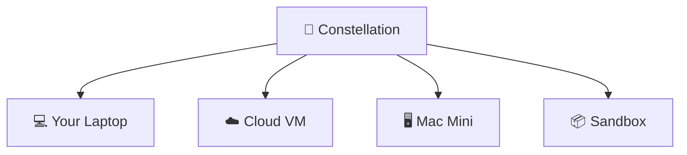

# Letta Code

[](https://www.npmjs.com/package/@letta-ai/letta-code) [](https://discord.gg/letta)

Letta Code is a memory-first agent harness, designed for long-lived agents that can learn from experience and maintain a cohesive identity across models (Claude, GPT, Gemini, GLM, Kimi, and more).

You can interact with Letta Code agents through:
* A local [**CLI**](https://docs.letta.com/letta-code/cli)
* The [**desktop app**](https://docs.letta.com/letta-code/desktop-app) for macOS, Windows, and Linux
* Your browser, including [mobile](https://docs.letta.com/letta-code/remote-mobile), at [chat.letta.com](https://chat.letta.com)
* Messaging integrations, including [Telegram](https://docs.letta.com/letta-code/channels#telegram-cli), [Slack](https://docs.letta.com/letta-code/channels#slack-cli), [Discord](https://docs.letta.com/letta-code/channels#discord-cli), and [custom channels](https://github.com/letta-ai/letta-code/blob/main/src/channels/README.md)

Letta Code is a frontier coding agent and can also be used as a long-lived personal agent.


## Feature Overview

> [!TIP]
> Letta Code agents are designed to be self-configuring. If you want to configure something (e.g. skills, behavior, hooks, permissions), try asking your agent to do it for you.

| Feature | Description |
|---|---|
| [Self-improvement & Learning](https://docs.letta.com/letta-code/self-improvement) | Agents programmatically rewrite their context to improve and adapt over time, including system prompt learning (through [memory blocks](https://www.letta.com/blog/memory-blocks)) and [skill learning](https://www.letta.com/blog/skill-learning). Configure periodic dreaming with `/sleeptime`, audit memory quality with `/doctor`, and view memory with `/palace` |
| [Message search](https://docs.letta.com/letta-code/conversation-search) | Search across all messages and agents with `/search`. Agent can also search their own conversations or the conversations of other agents |
| [MemFS](https://docs.letta.com/letta-code/memfs) | All context (including memory blocks) is tracked via git. Sync context to a custom GitHub repository by setting `/memory-repository set git@github.com:...` |
| [Skills](https://docs.letta.com/letta-code/skills) | Loads global skills (`~/.letta`), project-scoped skills (`.agents/skills`), and agent-scoped skills (stored in MemFS). View skills with `/skills` and create with `/skill-creator` |
| [Subagents & Multi-agent](https://docs.letta.com/letta-code/subagents) | Call built-in subagents (general-purpose, forked, recall, history-analyzer) async or sync. Agents can call any other agent (including themselves) as subagents |
| [Messaging Integrations](https://docs.letta.com/letta-code/channels) | Chat with the same agent from Slack, Telegram, your browser (chat.letta.com) including mobile, and through [custom channels](https://github.com/letta-ai/skills/blob/main/letta/creating-letta-code-channels/SKILL.md) |
| [Hooks](https://docs.letta.com/letta-code/hooks) | Run custom scripts at key points of agent execution to automate workflows |
| [Permissions](https://docs.letta.com/letta-code/permissions) | Set permission modes and customize what actions are auto-approved or auto-denied |
| [Crons & Schedules](https://docs.letta.com/letta-code/scheduling) | Configure heartbeats and crons, and let agents work across time with self-managed schedules |
| [Remote & Multi-Env](https://docs.letta.com/letta-code/client-server-architecture) (requires Constellation login) | Agents work across multiple environments. Make any machine available as a remote environment by running `letta server --env-name "..."` |
| [Secrets](https://docs.letta.com/letta-code/secrets) (requires Constellation login) | Make secrets available as environment variables (across machines) while obfuscating their values from context |

See the full list of slash commands in our [documentation](https://docs.letta.com/letta-code/slash-commands).

## Get started

Install the package via [npm](https://docs.npmjs.com/downloading-and-installing-node-js-and-npm):

```bash
npm install -g @letta-ai/letta-code
```

Navigate to your project directory and run `letta` (see command-line options [in the docs](https://docs.letta.com/letta-code/commands)).

On first run, choose how you want to start:

* **Proceed locally** keeps agent state on this device. This is the local-first path and does not require a Constellation login.
* **Login to Constellation** syncs agent state through Constellation so you can access the same agents from `chat.letta.com`, the desktop app, and other machines — and agents can work across multiple machines.

Run `/connect` to configure your own LLM API keys (OpenAI / ChatGPT, Anthropic, Z.ai coding plan, etc.), and use `/model` to swap models.

You can also download the [**desktop app**](https://docs.letta.com/letta-code/desktop-app) for macOS, Windows, and Linux. Agents created in the CLI are available via the desktop app, and vice versa.

## Local mode

Local mode runs an embedded stateful agent server inside Letta Code. Agents, conversations, memory, provider connections, and secrets are stored on your machine.

You can enter local mode from the first-run setup menu, or explicitly with:

```bash
letta --backend local
```

Connect a provider from inside the TUI with `/connect`, or from the shell with `letta --backend local connect`:

```bash
letta --backend local connect anthropic --api-key "$ANTHROPIC_API_KEY"
letta --backend local connect ollama
letta --backend local connect lmstudio
letta --backend local connect llama-cpp
letta --backend local connect chatgpt
```

For slow local inference servers, configure a provider-level timeout when connecting. For example, LM Studio-compatible llama-server backends that need up to 10 minutes for large-context compaction can use:

```bash
letta --backend local connect lmstudio --base-url http://127.0.0.1:1234/v1 --timeout 600s
```

Timeouts are stored per local provider in milliseconds; pass `--no-timeout` or `--timeout false` to disable the provider timeout.

Then create a local agent:

```bash
letta --backend local --new-agent --model anthropic/claude-sonnet-4-6
```

Local backend state is stored by default in:

```text
~/.letta/lc-local-backend
```

You can override this location for isolated experiments:

```bash
export LETTA_LOCAL_BACKEND_DIR="$PWD/.letta-local"
letta --backend local --new-agent
```

Local agents do not appear in the Constellation, but their memory is still a normal git repository under `~/.letta/lc-local-backend/memfs/<agent-id>/memory`.

## 🌌 Constellation

Agents hosted on Constellation can be accessed from any machine: your laptop, [GitHub Actions](https://github.com/letta-ai/letta-code-action), a sandbox, remote VM, or a Mac Mini. You can also chat with agents through [chat.letta.com](https://chat.letta.com/) or through the desktop app.



### Remote environments

If you're interacting with an agent from desktop or chat.letta.com, you can set agents to run on any available environment. Any machine can be made into an available environment by running:

```bash
letta server
letta server --env-name "work-laptop"
```

See our guides for using [Railway](https://docs.letta.com/letta-code/remote#railway), [DigitalOcean](https://docs.letta.com/letta-code/remote#digitalocean), and [Fly.io](https://docs.letta.com/letta-code/remote#flyio) as remote environments.

## Installing external skills

Install skills into a specific agent's memory with `letta skills install <skill>`: 

| Source | Example |
|---|---|
| GitHub | `letta skills install https://github.com/owner/repo`<br>`letta skills install https://github.com/owner/repo/tree/main/path/to/skill`<br>`letta skills install https://github.com/owner/repo/blob/main/path/to/skill/SKILL.md` |
| [ClawHub](https://clawhub.ai/) | `openclaw skills install <skill-slug>` → `letta skills install <skill-slug>` |
| [Hermes Skills Hub](https://hermes-agent.nousresearch.com/docs/skills/) | `hermes skills install <skill-path>` → `letta skills install <skill-path>` |

To view skills run `letta skills list --agent <agent-id>`, and delete skills with `letta skills delete <skill-name> --agent <agent-id>`.

## Research

Letta Code is developed by the creators of [MemGPT](https://arxiv.org/abs/2310.08560) and [sleep-time compute](https://arxiv.org/abs/2504.13171) (now called "dreaming"), and driven by our [research](https://www.letta.com/research) in AI memory and continual learning.

## Other

Community maintained packages are available for Arch Linux users on the [AUR](https://aur.archlinux.org/packages/letta-code):

```bash
yay -S letta-code # release
yay -S letta-code-git # nightly
```

Nix users can run or install Letta Code through the repository flake:
```bash
nix run github:letta-ai/letta-code
nix profile install github:letta-ai/letta-code
```

See [docs/nix.md](docs/nix.md) for Home Manager and NixOS service examples.

---

Made with 💜 in San Francisco

