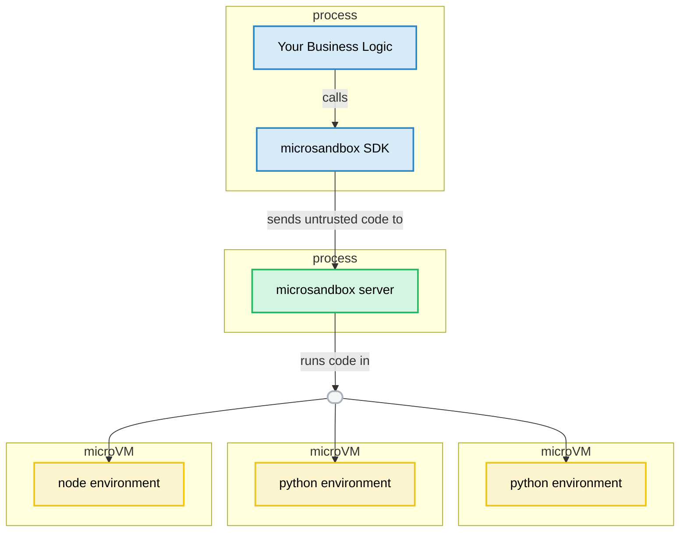

<a href="./#gh-dark-mode-only" target="_blank">

</a>
<a href="./#gh-light-mode-only" target="_blank">

</a>

<div align="center"><b>———&nbsp;&nbsp;&nbsp;easy secure execution of untrusted user/ai code&nbsp;&nbsp;&nbsp;———</b></div>

<!--
<div align="center">
  <br />
  <video src="https://github.com/user-attachments/assets/8c9c68ff-32ee-434a-b07a-b3309a0e1742" width="500" controls></video>
</div> -->

<div align="center">
  <br />
  </img>
</div>

<br />

<div align='center'>
  <a href="https://docs.microsandbox.dev" target="_blank">
    
  </a>
  <a href="https://discord.gg/T95Y3XnEAK" target="_blank">
    
  </a>
</div>

<br />

# <sub>&nbsp;&nbsp;WHY MICROSANDBOX?</sub>

Ever needed to run code you don't fully trust? Whether it's AI-generated code, user submissions, or experimental code, the traditional options all have serious drawbacks:

- **Running locally** - One malicious script and your entire system is compromised
- **Using containers** - Shared kernels mean sophisticated attacks can still break out
- **Traditional VMs** - Waiting 10+ seconds for a VM to boot kills productivity and performance
- **Cloud solutions** - Not as flexible, at the whim of the cloud provider

**microsandbox** combines the best of all worlds:

- [x] <span>&nbsp;&nbsp;<strong>Strong Isolation</strong> - Hardware-level VM isolation with [microVMs](./MSB_V_DOCKER.md)</span>
- [x] <span>&nbsp;&nbsp;<strong>Instant Startup</strong> - Boot times under 200ms, not 10+ seconds</span>
- [x] <span>&nbsp;&nbsp;<strong>Your Infrastructure</strong> - Self-hosted with full control</span>
- [x] <span>&nbsp;&nbsp;<strong>OCI Compatible</strong> - Works with standard container images</span>
- [x] <span>&nbsp;&nbsp;<strong>AI-Ready</strong> - Built-in [MCP support](./MCP.md) for seamless AI integration</span>

<div align='center'>• • •</div>

# <sub>&nbsp;&nbsp;SDK&nbsp;&nbsp;<sup><sup>B E T A</sup></sup></sub>

Get started in few easy steps:

<div align="center">
  <video src="https://github.com/user-attachments/assets/23618f92-5897-44d1-bfa6-1058f30c09ef" width="800" controls>
  </video>

<sup><small><a href="https://asciinema.org/a/itQE92vIJiyq1PAPnaGURzDpv" target="_blank">[ASCIINEMA →]</a></small></sup>

</div>

<div align='center'>
  
  
  
</div>

##

<h3><span>1</span>&nbsp;&nbsp;&nbsp;&nbsp;Start the Server</h3>

##### Install microsandbox

```sh
curl -sSL https://get.microsandbox.dev | sh
```

##### And start the server

```sh
msb server start --dev
```

> [!TIP]
>
> microsandbox server is also an [MCP server](./MCP.md), so it works directly with Claude, Agno and other MCP-enabled AI tools and agents.
>
> For more information on setting up the server, see the [self-hosting guide](./SELF_HOSTING.md).

##### Optionally pull the environment image

```sh
msb pull microsandbox/python
```

##

<h3><span>2</span>&nbsp;&nbsp;&nbsp;&nbsp;Install the SDK</h3>

##### Python

```sh
pip install microsandbox
```

##### JavaScript

```sh
npm install microsandbox
```

##### Rust

```sh
cargo add microsandbox
```

> [!NOTE]
> There are [SDKs](./sdk) for other languages as well! Join us in expanding support for your favorite language.
>
> <div align="left">
>   <a href="./sdk/python"></a>
>   <a href="./sdk/rust"></a>
>   <a href="./sdk/javascript"></a>
>   <a href="./sdk/c"></a>
>   <a href="./sdk/cpp"></a>
>   <a href="./sdk/crystal"></a>
>   <a href="./sdk/csharp"></a>
>   <a href="./sdk/dart"></a>
>   <a href="./sdk/elixir"></a>
>   <a href="./sdk/elm"></a>
>   <a href="./sdk/erlang"></a>
>   <a href="./sdk/fsharp"></a>
>   <a href="./sdk/go"></a>
>   <a href="./sdk/haskell"></a>
>   <a href="./sdk/java"></a>
>   <a href="./sdk/julia"></a>
>   <a href="./sdk/kotlin"></a>
>   <a href="./sdk/lua"></a>
>   <a href="./sdk/nim"></a>
>   <a href="./sdk/objc"></a>
>   <a href="./sdk/ocaml"></a>
>   <a href="./sdk/php"></a>
>   <a href="./sdk/r"></a>
>   <a href="./sdk/ruby"></a>
>   <a href="./sdk/scala"></a>
>   <a href="./sdk/swift"></a>
>   <a href="./sdk/zig"></a>
> </div>


##

<h3><span>3</span>&nbsp;&nbsp;&nbsp;&nbsp;Execute the Code</h3>

`microsandbox` offers a growing list of sandbox environment types optimized for different execution requirements. Choose the appropriate sandbox (e.g., PythonSandbox or NodeSandbox) to run your code in a secure tailored environment.

##### Python

```py
import asyncio
from microsandbox import PythonSandbox

async def main():
    async with PythonSandbox.create(name="test") as sb:
        exec = await sb.run("name = 'Python'")
        exec = await sb.run("print(f'Hello {name}!')")

    print(await exec.output()) # prints Hello Python!

asyncio.run(main())
```

##### JavaScript

```js
import { NodeSandbox } from "microsandbox";

async function main() {
  const sb = await NodeSandbox.create({ name: "test" });

  try {
    let exec = await sb.run("var name = 'JavaScript'");
    exec = await sb.run("console.log(`Hello ${name}!`)");

    console.log(await exec.output()); // prints Hello JavaScript!
  } finally {
    await sb.stop();
  }
}

main().catch(console.error);
```

##### Rust

```rs
use microsandbox::{SandboxOptions, PythonSandbox};

#[tokio::main]
async fn main() -> Result<(), Box<dyn std::error::Error>> {
    let mut sb = PythonSandbox::create(SandboxOptions::builder().name("test").build()).await?;

    let exec = sb.run(r#"name = "Python""#).await?;
    let exec = sb.run(r#"print(f"Hello {name}!")"#).await?;

    println!("{}", exec.output().await?); // prints Hello Python!

    sb.stop().await?;

    Ok(())
}
```

> [!NOTE]
>
> If you haven't pulled the environment image, the first run will take a while as it tries to download it.
> Executions will be much faster afterwards.
>
> For more information on how to use the SDK, [check out the SDK README](./sdk/README.md).

# <sub>&nbsp;&nbsp;PROJECTS&nbsp;&nbsp;<sup><sup>B E T A</sup></sup></sub>

Beyond the SDK, microsandbox supports project-based development with the familiar package-manager workflow devs are used to. Think of it like npm or cargo, but for sandboxes!

Create a `Sandboxfile`, define your environments, and manage your sandboxes with simple commands.

<br />

<a href="https://asciinema.org/a/7eOFf2Ovigi473FsKgr3Lpve1" target="_blank"></a>

##

#### Create a Sandbox Project

```sh
msb init
```

This creates a `Sandboxfile` in the current directory, which serves as the configuration manifest for your sandbox environments.

##

#### Add a Sandbox to the Project

```sh
msb add app \
    --image python \
    --cpus 1 \
    --memory 1024 \
    --start 'python -c "print(\"hello\")"'
```

The command above registers a new sandbox named `app` in your Sandboxfile, configured to use the `python` image.

You should now have a `Sandboxfile` containing a sandbox named **`app`**:

```sh
cat Sandboxfile
```

```yaml
# Sandbox configurations
sandboxes:
  app:
    image: python
    memory: 1024
    cpus: 1
    scripts:
      start: python -c "print(\"hello\")"
```

> [!TIP]
>
> Run `msb <subcommand> --help` to see all the options available for a subcommand.
>
> For example, `msb add --help`.

##

#### Running a Sandbox

##### Run a Sandbox Defined in Your Project

```sh
msb run --sandbox app
```

<div align="center">

_**or**_

</div>

```sh
msr app
```

This executes the default _start_ script of your sandbox. For more control, you can directly specify which script to run — `msr app~start`.

When running project sandboxes, all file changes and installations made inside the sandbox are automatically persisted to the `./menv` directory. This means you can stop and restart your sandbox any time without losing your work. Your development environment will be exactly as you left it.

##### Run an Temporary Sandbox

For experimentation or one-off tasks, temporary sandboxes provide a clean environment that leaves no trace:

```sh
msb exe --image python
```

<div align="center">

_**or**_

</div>

```sh
msx python
```

Temporary sandboxes are perfect for isolating programs you get from the internet. Once you exit the sandbox, all changes are discarded automatically.

##

#### Installing Sandboxes

The `msb install` command sets up a sandbox as a system-wide executable. It installs a slim launcher program that allows you to start your sandbox from anywhere in your system with a simple command.

```sh
msb install --image alpine
```

<div align="center">

_**or**_

</div>

```sh
msi alpine
```

After installation, you can start your sandbox by simply typing its name in any terminal:

```sh
alpine
```

This makes frequently used sandboxes incredibly convenient to access — no need to navigate to specific directories or remember complex commands. Just type the sandbox name and it launches immediately with all your configured settings.

> [!TIP]
> You can give your sandbox a descriptive, easy-to-remember name during installation:
>
> ```sh
> msi alpine:20250108 slim-linux
> ```
>
> This allows you to create multiple instances of the same sandbox image with different names and configurations. For example:
>
> - `msi python python-data-science` - A Python environment for data analysis
> - `msi python python-web` - A Python environment for web development
>
> Installed sandboxes maintain their state between sessions, so you can pick up exactly where you left off each time you launch them.

<div align='center'>• • •</div>

# <sub>&nbsp;&nbsp;USE CASES</sub>

<a href="https://microsandbox.dev#gh-dark-mode-only" target="_blank"></a>
<a href="https://microsandbox.dev#gh-light-mode-only" target="_blank"></a>

### Coding & Dev Environments

Let your AI agents build real apps with professional dev tools. When users ask their AI to create a web app, fix a bug, or build a prototype, it can handle everything from Git operations to dependency management to testing in a protected environment.

Your AI can create comprehensive development environments in milliseconds and run programs with full system access. The fast startup means developers get instant feedback and can iterate quickly. This makes it perfect for AI pair programming, coding education platforms, and automated code generation where quick results matter.

<!-- TODO: <div align="center"><a href="https://microsandbox.dev/docs/examples/coding">✨ See coding examples ✨</a></div> -->

<!-- Transparent pixel to create line break after floating image -->

<br>

<a href="https://microsandbox.dev#gh-dark-mode-only" target="_blank"></a>
<a href="https://microsandbox.dev#gh-light-mode-only" target="_blank"></a>

### Data Analysis

Transform raw numbers into meaningful insights with AI that works for you. Your AI can process spreadsheets, create charts, and generate reports safely. Whether it's analyzing customer feedback, sales trends, or research data, everything happens in a protected environment that respects data privacy.

Microsandbox lets your AI work with powerful libraries like NumPy, Pandas, and TensorFlow while creating visualizations that bring insights to life. Perfect for financial analysis tools, privacy-focused data processing, medical research, and any situation where you need serious computing power with appropriate safeguards.

<!-- TODO: <div align="center"><a href="https://microsandbox.dev/docs/examples/data-analysis">📊 Explore data examples 📊</a></div> -->

<!-- Transparent pixel to create line break after floating image -->

<br>

<a href="https://microsandbox.dev#gh-dark-mode-only" target="_blank"></a>
<a href="https://microsandbox.dev#gh-light-mode-only" target="_blank"></a>

### Web Browsing Agent

Build AI assistants that can browse the web for your users. Need to compare prices across stores, gather info from multiple news sites, or automate form submissions? Your AI can handle it all while staying in a contained environment.

With microsandbox, your AI can navigate websites, extract data, fill out forms, and handle logins. It can visit any site and deliver only the useful information back to your application. This makes it ideal for price comparison tools, research assistants, content aggregators, automated testing, and web automation workflows that would otherwise require complex setup.

<!-- TODO: <div align="center"><a href="https://microsandbox.dev/docs/examples/web-browsing">🌐 View web examples 🌐</a></div> -->

<!-- Transparent pixel to create line break after floating image -->

<br>

<a href="https://microsandbox.dev#gh-dark-mode-only" target="_blank"></a>
<a href="https://microsandbox.dev#gh-light-mode-only" target="_blank"></a>

### Instant App Hosting

Share working apps and demos in seconds without deployment headaches. When your AI creates a useful tool, calculator, visualization, or prototype, users can immediately access it through a simple link.

Zero-setup deployment means your AI-generated code can be immediately useful without complex configuration. Each app runs in its own protected space with appropriate resource limits, and everything cleans up automatically when no longer needed. Perfect for educational platforms hosting student projects, AI assistants creating live demos, and users needing immediate value.

<!-- TODO: <div align="center"><a href="https://microsandbox.dev/docs/examples/app-hosting">🚀 Try hosting examples 🚀</a></div> -->

<!-- Transparent pixel to create line break after floating image -->

<br>

<div align='center'>• • •</div>

### The Server Architecture



<div align='center'>• • •</div>

# <sub>&nbsp;&nbsp;DEVELOPMENT</sub>

Interested in contributing to microsandbox? Check out our [Development Guide](./DEVELOPMENT.md) for instructions on setting up your development environment, building the project, running tests, and creating releases.

For contribution guidelines, please refer to [CONTRIBUTING.md](./CONTRIBUTING.md).

<div align='center'>• • •</div>

# <sub>&nbsp;&nbsp;LICENSE</sub>

This project is licensed under the [Apache License 2.0](./LICENSE).

<div align='center'>• • •</div>

# <sub>&nbsp;&nbsp;ACKNOWLEDGMENTS</sub>

We'd like to thank the following projects and communities that made microsandbox possible:

- **[libkrun](https://github.com/containers/libkrun)** - The lightweight virtualization library that powers our secure microVM isolation

Special thanks to all our contributors, testers, and community members who help make microsandbox better every day!

<div align='center'>• • •</div>

# <sub>&nbsp;&nbsp;STAR HISTORY</sub>

Thanks for all the support!

<div align='center'>
  <a href="https://star-history.com/#microsandbox/microsandbox&Date">
   <picture>
     <source media="(prefers-color-scheme: dark)" srcset="https://api.star-history.com/svg?repos=microsandbox/microsandbox&type=Date&theme=dark" />
     <source media="(prefers-color-scheme: light)" srcset="https://api.star-history.com/svg?repos=microsandbox/microsandbox&type=Date" />
     
   </picture>
  </a>
</div>

<br />

<div align='center'>• • •</div>

