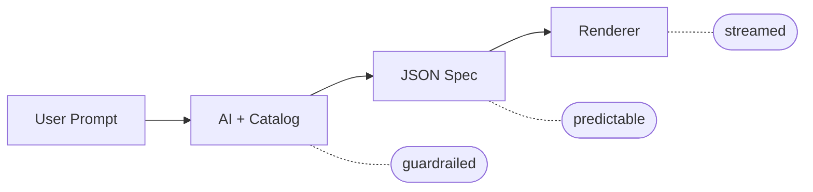

# json-render

**The Generative UI framework.**

Generate dynamic, personalized UIs from prompts without sacrificing reliability. Predefined components and actions for safe, predictable output.

```bash
# for React
npm install @json-render/core @json-render/react
# for React with pre-built shadcn/ui components
npm install @json-render/shadcn
# or for React Native
npm install @json-render/core @json-render/react-native
# or for video
npm install @json-render/core @json-render/remotion
# or for PDF documents
npm install @json-render/core @json-render/react-pdf
# or for Vue
npm install @json-render/core @json-render/vue
```

## Why json-render?

json-render is a **Generative UI** framework: AI generates interfaces from natural language prompts, constrained to components you define. You set the guardrails, AI generates within them:

- **Guardrailed** - AI can only use components in your catalog
- **Predictable** - JSON output matches your schema, every time
- **Fast** - Stream and render progressively as the model responds
- **Cross-Platform** - React, Vue (web), React Native (mobile) from the same catalog
- **Batteries Included** - 36 pre-built shadcn/ui components ready to use

## Quick Start

### 1. Define Your Catalog

```typescript
import { defineCatalog } from "@json-render/core";
import { schema } from "@json-render/react/schema";
import { z } from "zod";

const catalog = defineCatalog(schema, {
  components: {
    Card: {
      props: z.object({ title: z.string() }),
      description: "A card container",
    },
    Metric: {
      props: z.object({
        label: z.string(),
        value: z.string(),
        format: z.enum(["currency", "percent", "number"]).nullable(),
      }),
      description: "Display a metric value",
    },
    Button: {
      props: z.object({
        label: z.string(),
        action: z.string(),
      }),
      description: "Clickable button",
    },
  },
  actions: {
    export_report: { description: "Export dashboard to PDF" },
    refresh_data: { description: "Refresh all metrics" },
  },
});
```

### 2. Define Your Components

```tsx
import { defineRegistry, Renderer } from "@json-render/react";

const { registry } = defineRegistry(catalog, {
  components: {
    Card: ({ props, children }) => (
      <div className="card">
        <h3>{props.title}</h3>
        {children}
      </div>
    ),
    Metric: ({ props }) => (
      <div className="metric">
        <span>{props.label}</span>
        <span>{format(props.value, props.format)}</span>
      </div>
    ),
    Button: ({ props, emit }) => (
      <button onClick={() => emit("press")}>
        {props.label}
      </button>
    ),
  },
});
```

### 3. Render AI-Generated Specs

```tsx
function Dashboard({ spec }) {
  return <Renderer spec={spec} registry={registry} />;
}
```

**That's it.** AI generates JSON, you render it safely.

---

## Packages

| Package | Description |
|---------|-------------|
| `@json-render/core` | Schemas, catalogs, AI prompts, dynamic props, SpecStream utilities |
| `@json-render/react` | React renderer, contexts, hooks |
| `@json-render/vue` | Vue 3 renderer, composables, providers |
| `@json-render/shadcn` | 36 pre-built shadcn/ui components (Radix UI + Tailwind CSS) |
| `@json-render/react-native` | React Native renderer with standard mobile components |
| `@json-render/remotion` | Remotion video renderer, timeline schema |
| `@json-render/react-pdf` | React PDF renderer for generating PDF documents from specs |
| `@json-render/image` | Image renderer for SVG/PNG output (OG images, social cards) via Satori |
| `@json-render/redux` | Redux / Redux Toolkit adapter for `StateStore` |
| `@json-render/zustand` | Zustand adapter for `StateStore` |
| `@json-render/jotai` | Jotai adapter for `StateStore` |
| `@json-render/xstate` | XState Store (atom) adapter for `StateStore` |

## Renderers

### React (UI)

```tsx
import { defineRegistry, Renderer } from "@json-render/react";
import { schema } from "@json-render/react/schema";

// Flat spec format (root key + elements map)
const spec = {
  root: "card-1",
  elements: {
    "card-1": {
      type: "Card",
      props: { title: "Hello" },
      children: ["button-1"],
    },
    "button-1": {
      type: "Button",
      props: { label: "Click me" },
      children: [],
    },
  },
};

// defineRegistry creates a type-safe component registry
const { registry } = defineRegistry(catalog, { components });
<Renderer spec={spec} registry={registry} />
```

### Vue (UI)

```typescript
import { h } from "vue";
import { defineRegistry, Renderer } from "@json-render/vue";
import { schema } from "@json-render/vue/schema";

const { registry } = defineRegistry(catalog, {
  components: {
    Card: ({ props, children }) =>
      h("div", { class: "card" }, [h("h3", null, props.title), children]),
    Button: ({ props, emit }) =>
      h("button", { onClick: () => emit("press") }, props.label),
  },
});

// In your Vue component template:
// <Renderer :spec="spec" :registry="registry" />
```

### shadcn/ui (Web)

```tsx
import { defineCatalog } from "@json-render/core";
import { schema } from "@json-render/react/schema";
import { defineRegistry, Renderer } from "@json-render/react";
import { shadcnComponentDefinitions } from "@json-render/shadcn/catalog";
import { shadcnComponents } from "@json-render/shadcn";

// Pick components from the 36 standard definitions
const catalog = defineCatalog(schema, {
  components: {
    Card: shadcnComponentDefinitions.Card,
    Stack: shadcnComponentDefinitions.Stack,
    Heading: shadcnComponentDefinitions.Heading,
    Button: shadcnComponentDefinitions.Button,
  },
  actions: {},
});

// Use matching implementations
const { registry } = defineRegistry(catalog, {
  components: {
    Card: shadcnComponents.Card,
    Stack: shadcnComponents.Stack,
    Heading: shadcnComponents.Heading,
    Button: shadcnComponents.Button,
  },
});

<Renderer spec={spec} registry={registry} />
```

### React Native (Mobile)

```tsx
import { defineCatalog } from "@json-render/core";
import { schema } from "@json-render/react-native/schema";
import {
  standardComponentDefinitions,
  standardActionDefinitions,
} from "@json-render/react-native/catalog";
import { defineRegistry, Renderer } from "@json-render/react-native";

// 25+ standard components included
const catalog = defineCatalog(schema, {
  components: { ...standardComponentDefinitions },
  actions: standardActionDefinitions,
});

const { registry } = defineRegistry(catalog, { components: {} });
<Renderer spec={spec} registry={registry} />
```

### Remotion (Video)

```tsx
import { Player } from "@remotion/player";
import { Renderer, schema, standardComponentDefinitions } from "@json-render/remotion";

// Timeline spec format
const spec = {
  composition: { id: "video", fps: 30, width: 1920, height: 1080, durationInFrames: 300 },
  tracks: [{ id: "main", name: "Main", type: "video", enabled: true }],
  clips: [
    { id: "clip-1", trackId: "main", component: "TitleCard", props: { title: "Hello" }, from: 0, durationInFrames: 90 }
  ],
  audio: { tracks: [] }
};

<Player
  component={Renderer}
  inputProps={{ spec }}
  durationInFrames={spec.composition.durationInFrames}
  fps={spec.composition.fps}
  compositionWidth={spec.composition.width}
  compositionHeight={spec.composition.height}
/>
```

### React PDF (Documents)

```typescript
import { renderToBuffer } from "@json-render/react-pdf";

const spec = {
  root: "doc",
  elements: {
    doc: { type: "Document", props: { title: "Invoice" }, children: ["page-1"] },
    "page-1": {
      type: "Page",
      props: { size: "A4" },
      children: ["heading-1", "table-1"],
    },
    "heading-1": {
      type: "Heading",
      props: { text: "Invoice #1234", level: "h1" },
      children: [],
    },
    "table-1": {
      type: "Table",
      props: {
        columns: [{ header: "Item", width: "60%" }, { header: "Price", width: "40%", align: "right" }],
        rows: [["Widget A", "$10.00"], ["Widget B", "$25.00"]],
      },
      children: [],
    },
  },
};

// Render to buffer, stream, or file
const buffer = await renderToBuffer(spec);
```

### Image (SVG/PNG)

```typescript
import { renderToPng } from "@json-render/image/render";

const spec = {
  root: "frame",
  elements: {
    frame: {
      type: "Frame",
      props: { width: 1200, height: 630, backgroundColor: "#1a1a2e" },
      children: ["heading"],
    },
    heading: {
      type: "Heading",
      props: { text: "Hello World", level: "h1", color: "#ffffff" },
      children: [],
    },
  },
};

// Render to PNG (requires @resvg/resvg-js)
const png = await renderToPng(spec, { fonts });

// Or render to SVG string
import { renderToSvg } from "@json-render/image/render";
const svg = await renderToSvg(spec, { fonts });
```

## Features

### Streaming (SpecStream)

Stream AI responses progressively:

```typescript
import { createSpecStreamCompiler } from "@json-render/core";

const compiler = createSpecStreamCompiler<MySpec>();

// Process chunks as they arrive
const { result, newPatches } = compiler.push(chunk);
setSpec(result); // Update UI with partial result

// Get final result
const finalSpec = compiler.getResult();
```

### AI Prompt Generation

Generate system prompts from your catalog:

```typescript
const systemPrompt = catalog.prompt();
// Includes component descriptions, props schemas, available actions
```

### Conditional Visibility

```json
{
  "type": "Alert",
  "props": { "message": "Error occurred" },
  "visible": [
    { "$state": "/form/hasError" },
    { "$state": "/form/errorDismissed", "not": true }
  ]
}
```

### Dynamic Props

Any prop value can be data-driven using expressions:

```json
{
  "type": "Icon",
  "props": {
    "name": { "$cond": { "$state": "/activeTab", "eq": "home" }, "$then": "home", "$else": "home-outline" },
    "color": { "$cond": { "$state": "/activeTab", "eq": "home" }, "$then": "#007AFF", "$else": "#8E8E93" }
  }
}
```

Expression forms:

- **`{ "$state": "/state/key" }`** - reads a value from the state model
- **`{ "$cond": <condition>, "$then": <value>, "$else": <value> }`** - evaluates a condition and picks a branch
- **`{ "$template": "Hello, ${/user/name}!" }`** - interpolates state values into strings
- **`{ "$computed": "fn", "args": { ... } }`** - calls a registered function with resolved args

### Actions

Components can trigger actions, including the built-in `setState` action:

```json
{
  "type": "Pressable",
  "props": { "action": "setState", "actionParams": { "statePath": "/activeTab", "value": "home" } },
  "children": ["home-icon"]
}
```

The `setState` action updates the state model directly, which re-evaluates visibility conditions and dynamic prop expressions.

### State Watchers

React to state changes by triggering actions:

```json
{
  "type": "Select",
  "props": { "value": { "$bindState": "/form/country" }, "options": ["US", "Canada", "UK"] },
  "watch": {
    "/form/country": { "action": "loadCities", "params": { "country": { "$state": "/form/country" } } }
  }
}
```

`watch` is a top-level field on elements (sibling of `type`/`props`/`children`). Watchers fire when the watched value changes, not on initial render.

---

## Demo

```bash
git clone https://github.com/vercel-labs/json-render
cd json-render
pnpm install
pnpm dev
```

- http://json-render.localhost:1355 - Docs & Playground
- http://dashboard-demo.json-render.localhost:1355 - Example Dashboard
- http://remotion-demo.json-render.localhost:1355 - Remotion Video Example
- Chat Example: run `pnpm dev` in `examples/chat`
- Vue Example: run `pnpm dev` in `examples/vue`
- Vite Renderers (React + Vue): run `pnpm dev` in `examples/vite-renderers`
- React Native example: run `npx expo start` in `examples/react-native`

## How It Works



1. **Define the guardrails** - what components, actions, and data bindings AI can use
2. **Prompt** - describe what you want in natural language
3. **AI generates JSON** - output is always predictable, constrained to your catalog
4. **Render fast** - stream and render progressively as the model responds

## License

Apache-2.0

