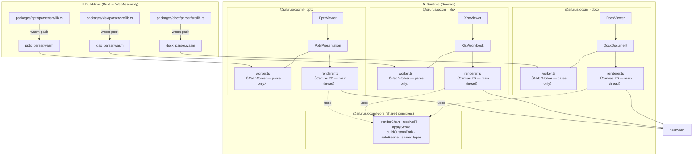

> **This entire codebase — Rust parsers, TypeScript renderers, tests, and tooling — is implemented by AI coding agents, primarily [Claude](https://claude.ai) and [Codex](https://openai.com/codex/)**, through iterative prompting. No human-written application code exists in this repository.

<details>
<summary><b>Why this project exists — a note from the author</b></summary>

<br>

OOXML's behavior is defined by a written specification (ECMA-376 / ISO-29500), and there is a clear answer to compare against: Word, Excel, and PowerPoint themselves. In principle, anyone with enough patience could have built a faithful viewer — the spec says what to implement, and the Office applications show whether you got it right.

In practice, it didn't happen. For more than a decade, no free, open-source library reached a rendering quality good enough for real use. There are a few commercial libraries with decent fidelity (and editing support), but their pricing makes them hard to adopt casually. I think the reason is simply cost: the specification is huge, and reading and implementing it faithfully takes far more effort than volunteers can afford.

Generative AI changed that. A viewer is an unusually good fit for AI-driven iterative development ("vibe coding"): there is a spec to read and a correct output to aim for, so the work comes down to interpreting the specification and refining the rendering until it matches. Limiting the scope to viewing also avoids the most serious risk an Office library can carry — corrupting a user's files.

So I'm building this library with AI coding agents, spec-first, and keeping it free to use. For some documents it already reproduces the desktop Office applications more faithfully than commercial libraries — and sometimes even the official Microsoft 365 web apps.

</details>

<p align="center">
  
</p>

# Office Open XML Viewer

[](https://www.npmjs.com/package/@silurus/ooxml)
[](https://www.npmjs.com/package/@silurus/ooxml)
[](https://marketplace.visualstudio.com/items?itemName=silurus.office-open-xml-viewer)
[](./LICENSE)

**[Live demo](https://ooxml.silurus.dev)**

A browser-based viewer for Office Open XML documents that renders to an HTML Canvas element.
The parsers are written in Rust and compiled to WebAssembly; the renderers use the Canvas 2D API.
Each format also exposes a headless engine (`DocxDocument` / `XlsxWorkbook` / `PptxPresentation`) that renders into any caller-supplied canvas, so you can compose your own UI — scroll views, thumbnail grids, master-detail panes — instead of being locked into the built-in viewer. See the [live framework examples](https://ooxml.silurus.dev/frameworks/) for runnable React, Vue, Svelte, and Solid projects.

## Project scope: read-only viewing

This project is intentionally a **read-only viewer**. Editing interfaces, mutation APIs, editable or lossless document models, saving / round-tripping, and partial editing of DOCX, XLSX, or PPTX files are out of scope. Read-only interactions such as selection, copy, search, shape IDs, hit testing, and annotation or external-tool integrations remain in scope, and editing-focused forks are welcome. See [#496](https://github.com/yukiyokotani/office-open-xml-viewer/issues/496) for the rationale.

| DOCX | XLSX | PPTX |
|:---:|:---:|:---:|
|  |  |  |

```bash
npm install @silurus/ooxml
# or
pnpm add @silurus/ooxml
```

> **Bundler note**: the Rust parsers ship as real `.wasm` asset files next to the
> JavaScript, referenced with the standard `new URL('…', import.meta.url)` form
> and fetched (streaming-compiled) at load time. Verified to work with zero
> config: **webpack 5**, **Next.js** (Turbopack, dev and build), **Vite 8**
> (dev and build), **Vite 7 production builds**, and a plain
> `<script type="module">` with no bundler at all. Two setups need a hand:
>
> - **Vite 7 dev server**: the dependency optimizer rewrites the asset reference
>   into its own cache path and the load fails (fixed in Vite 8). Add
>   `optimizeDeps: { exclude: ['@silurus/ooxml'] }` to your `vite.config` —
>   production builds are unaffected.
> - **esbuild / Angular CLI** (whose application builder is esbuild-based):
>   `new URL` asset references are not processed
>   ([esbuild#795](https://github.com/evanw/esbuild/issues/795)). Copy the
>   `.wasm` into your served output and point the viewer at it with the
>   `wasmUrl` load option. For Angular CLI, copy the required
>   `*_parser_bg.wasm` asset from `node_modules/@silurus/ooxml/dist` into the
>   served output and pass its public URL to the viewer.
>
> `wasmUrl` also serves the parser WASM from a CDN or any path you control:
>
> ```typescript
> new DocxViewer(canvas, { wasmUrl: 'https://cdn.example.com/docx_parser_bg.wasm' });
> ```

> **Bundle size note**: the package is ESM-only (`.mjs`). npm's *Unpacked
> Size* sums every entry bundle **and** the standalone MathJax + STIX Two Math
> asset, so the reported figure is much larger than any single app build. For
> v0.76.2, the complete npm package is approximately 11.2 MB unpacked (3.7 MB
> as the downloaded tarball), while a format-specific application graph is
> approximately:
>
> | Imported entry | Reachable assets | gzip | Includes |
> |---|---:|---:|---|
> | `@silurus/ooxml/docx` | 3.9 MB | 1.2 MB | DOCX renderer, parser WASM, and lazy worker |
> | `@silurus/ooxml/xlsx` | 2.5 MB | 0.81 MB | XLSX renderer, parser WASM, and lazy worker |
> | `@silurus/ooxml/pptx` | 2.5 MB | 0.77 MB | PPTX renderer, parser WASM, and lazy worker |
> | `@silurus/ooxml/math` | 3.1 MB | 1.1 MB | Optional MathJax + STIX Two Math engine |
>
> These are production-artifact estimates, not initial-load figures: each row
> sums all assets reachable from that entry, including parser WASM and worker
> chunks loaded on demand. Exact output varies by bundler and compression. Import
> only the format you need (for example, `@silurus/ooxml/pptx`) so the other
> formats can be tree-shaken. The math engine is a **separate entry** whose
> main-thread chunk is a ~1 KB loader referencing the ~3 MB engine as a
> **sibling file**, not an inline data URL. The engine is fetched lazily, only
> when a document contains equations, and only if you imported
> `@silurus/ooxml/math` and passed it to a viewer (see
> [Rendering equations](#rendering-equations)). Never import the `math` entry
> and the loader chunk never enters your graph at all.

---

## Quick Start

```typescript
import { DocxViewer } from '@silurus/ooxml/docx';
import { XlsxSheetViewer, XlsxViewer, XlsxWorkbook } from '@silurus/ooxml/xlsx';
import { PptxViewer } from '@silurus/ooxml/pptx';

// DOCX — caller provides the <canvas>
const docxCanvas = document.getElementById('docx-canvas') as HTMLCanvasElement;
const docx = new DocxViewer(docxCanvas);
await docx.load('/document.docx');
docx.nextPage();

// XLSX — viewer manages its own <canvas> + tab bar
const container = document.getElementById('xlsx-container') as HTMLElement;
const xlsx = new XlsxViewer(container);
await xlsx.load('/workbook.xlsx');
xlsx.setSelection('B2:D5'); // A1 strings describe geometry; the normalized upper-left is ActiveCell

// Excel keeps Selection and ActiveCell separate. Use structured state when the
// active cell or Shift-extension anchor is not the area's upper-left cell.
xlsx.setSelection({
  areas: [{ kind: 'cells', top: 2, left: 2, bottom: 5, right: 4 }],
  activeAreaIndex: 0,
  activeCell: { row: 3, col: 3 },
  extensionAnchor: { row: 2, col: 2 },
});

// Read-only, serializable context for an AI/MCP request. Populated cells are
// bounded and detached; formulas and Viewer-formatted display text are retained.
const context = xlsx.getSelectionContext({
  maxCells: 1_000,
  maxTextCharacters: 1_048_576,
});

// XLSX active-sheet surface only — caller provides the <canvas>
const sheetCanvas = document.getElementById('xlsx-canvas') as HTMLCanvasElement;
const sheet = new XlsxSheetViewer(sheetCanvas);
await sheet.load('/workbook.xlsx');
await sheet.goToSheet(1);

// Share one parsed workbook across independently scrollable sheet canvases,
// including canvases created in same-origin popup windows.
const workbook = await XlsxWorkbook.load('/workbook.xlsx');
const firstCanvas = document.getElementById('xlsx-first-canvas') as HTMLCanvasElement;
const secondCanvas = document.getElementById('xlsx-second-canvas') as HTMLCanvasElement;
const firstSheet = XlsxSheetViewer.fromWorkbook(firstCanvas, workbook);
const secondSheet = XlsxSheetViewer.fromWorkbook(secondCanvas, workbook);
await Promise.all([
  firstSheet.goToSheet(0),
  secondSheet.goToSheet(1),
]);

// Each viewer borrows the workbook; the caller closes it after the viewers.
firstSheet.destroy();
secondSheet.destroy();
workbook.destroy();

// PPTX — caller provides the <canvas>
const pptxCanvas = document.getElementById('pptx-canvas') as HTMLCanvasElement;
const pptx = new PptxViewer(pptxCanvas);
await pptx.load('/deck.pptx');
pptx.nextSlide();
```

### Rendering equations

OMML equations (`m:oMath` / `m:oMathPara`) in `.docx`, `.pptx` and `.xlsx` are rendered with
[MathJax](https://www.mathjax.org/) + [STIX Two Math](https://github.com/stipub/stixfonts).
That engine is ~3 MB, so it is **opt-in**: import the `math` engine from the separate
`@silurus/ooxml/math` entry and pass it to the viewer. Pass it and equations render;
omit it and the engine is referenced nowhere, so a bundler leaves it out of your build
entirely (equations are simply skipped). When you *do* pass it, the ~3 MB engine ships
as a **standalone asset file** next to the bundle rather than an inline data URL, and is
fetched **on demand — only the first time a document actually contains an equation**, so
equation-free documents never pay for it. It is fully self-contained: served from your own
origin, no cross-origin requests.

```typescript
import { DocxViewer } from '@silurus/ooxml/docx';
import { math } from '@silurus/ooxml/math';

const canvas = document.getElementById('docx-canvas') as HTMLCanvasElement;
const docx = new DocxViewer(canvas, { math }); // ← equations now render
await docx.load('/paper-with-equations.docx');
```

The same `math` engine works for every viewer (`DocxViewer`, `PptxViewer`,
`XlsxViewer`) and every headless engine (`DocxDocument`, `PptxPresentation`,
`XlsxWorkbook`). You inject it **once** where you create the object — the viewer
constructor or the `.load()` options — and every render reuses it; it is never a
per-render argument. (Excel stores "Insert > Equation" as OMML inside the shared
DrawingML `<xdr:txBody>` grammar, so `XlsxViewer` renders equations embedded in
shapes / text boxes the same way.)

### Off-main-thread rendering

By default the headless engines parse in a worker but render on the main thread.
Pass `mode: 'worker'` to `.load()` to parse **and** render entirely inside a Web
Worker — the main thread only paints the returned `ImageBitmap` via a
`bitmaprenderer` context, keeping it free for scrolling and input. It requires
`Worker` + `OffscreenCanvas`.

```typescript
import { PptxPresentation } from '@silurus/ooxml/pptx';

// Render entirely inside a Web Worker — the main thread only paints bitmaps.
const pres = await PptxPresentation.load('/deck.pptx', { mode: 'worker' });
const canvas = document.getElementById('pptx-canvas') as HTMLCanvasElement;
const bitmap = await pres.renderSlideToBitmap(0, { width: 960, dpr: window.devicePixelRatio });
const ctx = canvas.getContext('bitmaprenderer') as ImageBitmapRenderingContext;
ctx.transferFromImageBitmap(bitmap); // consumes the bitmap
```

The `*ToBitmap` method exists on all three engines —
`PptxPresentation.renderSlideToBitmap(slideIndex, opts)`,
`DocxDocument.renderPageToBitmap(pageIndex, opts)`, and
`XlsxWorkbook.renderViewportToBitmap(sheetIndex, viewport, opts)` (the xlsx
variant **requires** `opts.width` and `opts.height`, since a worker has no DOM
element to measure). They work in **both** modes — in main mode they render to
an internal `OffscreenCanvas` — so you can write mode-agnostic code.

Notes:

- The returned `ImageBitmap` is owned by the caller: `transferFromImageBitmap`
  consumes it, or call `bitmap.close()` when done.
- The canvas-target methods (`renderSlide(canvas)`, `renderPage(canvas)`,
  `renderViewport(canvas)`) are unavailable in worker mode — use the `*ToBitmap`
  variants instead.
- OMML equations require `mode: 'main'`; in worker mode they are skipped (with a
  console warning).
- Trade-off: worker mode keeps the main thread responsive, but each frame is
  transferred back as an `ImageBitmap`, so a single render can be marginally
  slower than `mode: 'main'`. Choose it for non-blocking UI, not raw speed.

### Continuous scroll viewers

`DocxScrollViewer` and `PptxScrollViewer` render the whole document as one
vertically-scrolling, PDF-reader-style surface instead of a single page/slide at
a time. Unlike `DocxViewer` / `PptxViewer` (which take a `<canvas>`), the scroll
viewers take a **container** `<div>` — they own the scroll host, virtualize the
page/slide list (only the visible window plus a small overscan is mounted), and
recycle canvases as you scroll.

```typescript
import { DocxScrollViewer } from '@silurus/ooxml/docx';

const container = document.getElementById('docx-scroll') as HTMLElement;
const viewer = new DocxScrollViewer(container);
await viewer.load('/document.docx');
// viewer.scrollToPage(3);
// viewer.pageCount, viewer.topVisiblePage
```

```typescript
import { PptxScrollViewer } from '@silurus/ooxml/pptx';

const container = document.getElementById('pptx-scroll') as HTMLElement;
const viewer = new PptxScrollViewer(container);
await viewer.load('/deck.pptx');
// viewer.scrollToSlide(2);
// viewer.slideCount, viewer.topVisibleSlide
```

The container must have a bounded height (e.g. `height: 100vh` or a flex child)
so the viewer can size its scroll host to it. Base zoom fits the first page/slide
width to the container width and re-fits on resize; a `0`-width container defers
layout until it has width. Call `destroy()` to tear down (a self-loaded engine is
destroyed with it; a borrowed one is not — see below).

Pass `refitOnResize: false` when the viewport must not determine the document's
physical display size. An explicit pre-load `setScale(1)` then keeps the same
authored font size at roughly the same on-screen size for portrait pages,
landscape pages, and slides; users can still zoom or call `fitWidth()` /
`fitPage()` explicitly.

**Desk appearance.** The viewer paints each page/slide on its own white canvas
with a soft drop shadow, over a transparent "desk". Style the desk and the sheet
gaps without any wrapper CSS:

```typescript
const viewer = new DocxScrollViewer(container, {
  background: '#f3f4f6',            // the desk behind / between pages
  gap: 24,                          // vertical gap between pages
  paddingTop: 32,                   // desk padding above the first page
  pageShadow: '0 0 0 1px #c8ccd0',  // crisp 1px "border" look (box-shadow never shifts layout)
  // pageShadow: false,             // flat pages, no shadow
});
```

`paddingBottom`, `paddingLeft` and `paddingRight` each default to `gap`, so the
sheet sits inside a uniform desk margin; pass `0` for a flush edge.

**Zoom.** `Ctrl`/`⌘` + mouse-wheel (and trackpad pinch) zooms the surface;
bare-wheel still scrolls natively. Zoom is flicker-free — a rapid gesture shows a
CSS preview and settles into a crisp re-render when it pauses. Bounds are the
absolute scale factors `zoomMin` / `zoomMax` (default `0.1` / `4`), and
`setScale(scale)` sets it programmatically. Pass `enableZoom: false` to disable.

**Text selection and find.** Pass `enableTextSelection: true` to overlay a
transparent, selectable text layer per page/slide for native copy. It works in
both `mode: 'main'` and `mode: 'worker'`; worker rendering returns the retained
text-run geometry beside each bitmap. `findText()`, `findNext()`, `findPrev()`,
and `clearFind()` search the complete document, including virtualized pages or
slides outside the mounted window. Set `findHighlightColors: { match, active }`
on any viewer to override the two overlay backgrounds with CSS colors; use an
alpha color when the canvas text should remain visible through the highlight.

**Selection context for AI/MCP.** Every Viewer exposes one read-only query,
`getSelectionContext()`, for handing the user's current focus to an external
assistant. The result is a detached, JSON-serializable snapshot discriminated by
`format` and `kind`; it never exposes a mutable document model or sends data over
the network. Text, run locators, and populated XLSX cells have hard resource
limits. Check `truncated` / `truncationReasons` before building a prompt.

```typescript
const docx = new DocxViewer(docxCanvas, {
  enableTextSelection: true,
  onSelectionContextChange(context) {
    // context.kind === 'text': selected text + page/paragraph/run locators
    updateAskAiButton(context);
  },
});

const pptx = new PptxViewer(pptxCanvas, {
  enableTextSelection: true,
  enableElementSelection: true,
  onSelectionContextChange(context) {
    // Text selection wins while it exists; otherwise a slide-element click
    // yields kind === 'element' with compact bounds, provenance and content.
    updateAskAiButton(context);
  },
});

const spreadsheet = new XlsxViewer(container, {
  onSelectionStateChange() {
    updateAskAiButton(spreadsheet.getSelectionContext({ maxCells: 1_000 }));
  },
});
const spreadsheetContext = spreadsheet.getSelectionContext({ maxCells: 1_000 });
// format === 'xlsx', kind === 'range': selection state, displayed values,
// formulas and populated cells only.
```

DOCX/PPTX callbacks are notifications for native text selection or PPTX element
focus; callers may instead query on demand. XLSX already has
`onSelectionStateChange`, so use that notification and call the same getter.
`PptxPresentation.getElementContextAt()` provides the identical compact element
query for custom/headless slide surfaces in both main and worker modes. PPTX
element provenance is limited to `master | layout | slide`; editor tree indexes,
archive paths, save/round-trip handles, and mutation APIs are deliberately absent.
When switching on `kind`, retain a default branch so a future read-only focus kind
can be added without changing the transport envelope.
See the [selection-context guide](docs/selection-context.md) for the complete
contract, resource bounds, PPTX hit-testing semantics, and extension policy.

**Hyperlinks.** For DOCX/PPTX the link hit regions live on the text-selection
overlay, so hyperlink interaction requires `enableTextSelection: true`; when that
overlay is enabled, links are interactive by default. XLSX hit-tests cells
directly, so links are interactive out of the box. An external link opens in a
new tab (scheme-sanitized to `http` / `https` / `mailto` / `tel`, `noopener`),
and an internal target navigates within the document (docx bookmark, pptx slide
jump, xlsx sheet). Pass `onHyperlinkClick(target)` to take over the click
yourself.
Pass `enableHyperlinks: false` to disable hyperlink interactivity entirely — no
hit-testing, no pointer cursor over links, no default navigation, and
`onHyperlinkClick` is never called; links still render as authored but are inert.
This applies to every viewer that supports hyperlinks (`DocxViewer`,
`DocxScrollViewer`, `PptxViewer`, `PptxScrollViewer`, `XlsxViewer`,
`XlsxSheetViewer`).

**Choose one loading mode.** For the normal one-view case, construct a Viewer and
call `viewer.load(source)`: the Viewer owns the parsed engine, may replace it on a
later load, and destroys it during teardown. For master–detail, multi-pane, or
multi-window UIs, create the Viewer from an already-loaded headless engine so
every view shares **one** parse. The two modes are mutually exclusive: on a
Viewer returned by a `from*()` factory, `load()` is unsupported, the engine's
own `mode` wins, and `destroy()` leaves the borrowed engine intact — the caller
owns its lifecycle.

| Use case | Acquisition | Engine owner |
| --- | --- | --- |
| One Viewer | `new Viewer(target)` then `viewer.load(source)` | Viewer |
| Shared parse | `Engine.load(source)` then `Viewer.fromDocument / fromPresentation / fromWorkbook(...)` | Caller |

```typescript
import { DocxDocument, DocxScrollViewer, DocxViewer } from '@silurus/ooxml/docx';

const document = await DocxDocument.load('/document.docx'); // parse once
const scroll = DocxScrollViewer.fromDocument(container, document);
const page = DocxViewer.fromDocument(canvas, document);
await page.goToPage(0);
// ...also drive a thumbnail grid or more panes from the same document.
page.destroy();
scroll.destroy();  // the borrowed document is NOT destroyed — you own it
document.destroy(); // release it yourself when every pane is gone
```

`PptxViewer` and `PptxScrollViewer` use `fromPresentation(...)`; `XlsxViewer`
and `XlsxSheetViewer` use `fromWorkbook(...)`.

For presentations, `enableMediaPlayback: true` makes embedded audio and video
interactive inside the real viewport plus `mediaOverscan` slides. Other mounted
slides remain static and selectable, avoiding offscreen media blobs and
animation loops.

Both viewers also expose `relayout()` (force a re-fit when the container resizes
in a way a `ResizeObserver` cannot see — e.g. a late web-font load),
`onVisiblePageChange` / `onVisibleSlideChange` (fires when the top-most visible
page/slide changes), and `onError` (async per-page render failures are routed
here instead of crashing the scroll loop). The parse/render knobs from the
headless engines (`mode`, `useGoogleFonts`, `resourceLimits`, the deprecated
`maxZipEntryBytes` alias, `math`, `dpr`) are accepted too.

### Markdown export

Every headless engine can project its document to GitHub-flavoured markdown for
LLM ingestion, full-text search, or diffing — headings, lists, tables, and (for
docx) footnotes / comments are preserved; layout, fonts, and positioning are
dropped. The projection is compiled into the parser WASM you already ship, so it
adds **zero** bundle weight. `toMarkdown()` works in both `mode: 'main'` and
`mode: 'worker'` (it runs off the archive opened at `load()`):

```typescript
import { DocxDocument } from '@silurus/ooxml/docx';

const doc = await DocxDocument.load('/document.docx');
const md = await doc.toMarkdown();
```

`PptxPresentation.toMarkdown()` (title slides → `#` headings, body → nested
bullets, notes / comments collated) and `XlsxWorkbook.toMarkdown()` (each sheet →
a `## SheetName` pipe table) are the twins.

For a one-off conversion outside a viewer, the standalone
`@silurus/ooxml-markdown` package exposes the low-level functions and a CLI:

```typescript
import { docxToMarkdown, initDocxFromBytes } from '@silurus/ooxml-markdown';

initDocxFromBytes(wasmBytes);          // the docx parser's `_bg.wasm`
const md = docxToMarkdown(fileBytes);  // ArrayBuffer | Uint8Array | Buffer
```

```bash
npx ooxml-md document.docx            # → stdout
npx ooxml-md deck.pptx -o deck.md     # → file
```

---

<details>
<summary><strong>Architecture diagram</strong></summary>



All three formats follow the same shape: the worker parses the `.docx` / `.xlsx` / `.pptx` archive via WASM and posts a JSON model back to the main thread, where the renderer draws to the canvas. Rendering stays on the main thread so the canvas shares the document's `FontFaceSet` — an `OffscreenCanvas` in a worker has its own font registry and would silently fall back to a system font, producing subtly different text measurements (and wrap positions) from the installed theme webfonts. `@silurus/ooxml-core` holds the cross-format primitives that the three renderers all depend on: a unified chart renderer (bar / line / area / radar / waterfall), shape helpers (`resolveFill`, `applyStroke`, `buildCustomPath`, `hexToRgba`), the `autoResize` viewer utility, and the shared type definitions.

### Key files

| File | Role |
|------|------|
| `packages/docx/parser/src/lib.rs` | Rust WASM parser — DOCX ZIP → `Document` JSON |
| `packages/xlsx/parser/src/lib.rs` | Rust WASM parser — XLSX ZIP → `Workbook` JSON |
| `packages/pptx/parser/src/lib.rs` | Rust WASM parser — PPTX ZIP → `Presentation` JSON |
| `packages/docx/src/renderer.ts` | Canvas 2D rendering engine with text layout (main thread) |
| `packages/xlsx/src/renderer.ts` | Canvas 2D rendering engine with virtual scroll (main thread) |
| `packages/pptx/src/renderer.ts` | Canvas 2D rendering engine (main thread) |
| `packages/*/src/worker.ts` | Web Worker: WASM init and parsing only (one per format) |
| `packages/*/src/viewer.ts` | Public Viewer API — canvas lifecycle, navigation |
| `packages/core/src/index.ts` | Cross-format primitives — chart renderer, shape helpers, `autoResize`, shared types |

</details>

---

## Framework Examples

Runnable TypeScript projects are available for
[React](https://ooxml.silurus.dev/frameworks/react/),
[Vue](https://ooxml.silurus.dev/frameworks/vue/),
[Svelte](https://ooxml.silurus.dev/frameworks/svelte/), and
[Solid](https://ooxml.silurus.dev/frameworks/solid/). Each guide embeds the
complete StackBlitz project and supports selecting a local DOCX, XLSX, or PPTX
file without uploading it.

---

## Feature Support

### Word (.docx)

| Category | Feature | Status |
|----------|---------|--------|
| **Document** | Page rendering | ✅ |
| | Page size and margins | ✅ |
| | Headers / footers (default / first / even) | ✅ |
| | Section breaks (continuous / nextPage / oddPage / evenPage) | ✅ |
| | Page borders (`w:pgBorders`, §17.6.10 — standard line styles, offsetFrom / display / zOrder; art borders not yet supported) | ✅ |
| | Line numbering (`w:lnNumType`, §17.6.8) | ✅ |
| | Section vertical alignment (`w:vAlign`, §17.6.22) | ✅ |
| **Text** | Paragraphs | ✅ |
| | Bold, italic, underline, strikethrough | ✅ |
| | Font family, size, color | ✅ |
| | Hyperlinks | ✅ |
| | Superscript / subscript (`w:vertAlign`) | ✅ |
| | Ruby annotations / furigana (`w:ruby`) | ✅ |
| **Formatting** | Paragraph alignment (left / center / right / justify / distribute — CJK `both`/`distribute` spread by inter-character pitch, §17.18.44) | ✅ |
| | Line spacing (auto / atLeast / exact) | ✅ |
| | Document grid (`w:docGrid`, §17.6.5 — line pitch + East Asian character grid / 字詰め) | ✅ |
| | Margin collapsing between paragraphs | ✅ |
| | Indents and tab stops | ✅ |
| | Multi-column section layout (`w:cols`, §17.6.4 — newspaper-flow columns; full-width floats span all columns) | ✅ |
| | Lists (bullet and numbered, multi-level `%N` markers §17.9.11) | ✅ |
| | Paragraph styles (Heading 1–9, Normal, custom) | ✅ |
| | Table style `w:pPr` cascade (§17.7.6) | ✅ |
| | Table style borders / shading / banding (`tblStylePr`, `cnfStyle`, §17.4.7) | ✅ |
| | Table of contents (TOC field) — dot leaders, right-aligned page numbers | ✅ |
| | keepNext / keepLines / widowControl | ✅ |
| | Right-to-left text — UAX#9 bidi, `w:bidi` / `w:rtl`, complex-script formatting (`w:szCs` / `w:bCs` / `rFonts@cs`, §17.3.2.26), RTL lists and indents | ✅ |
| | Japanese kinsoku line breaking (`w:kinsoku`, §17.15.1.58 — 行頭/行末禁則) | ✅ |
| | Vertical writing (縦書き — UAX#50 vertical glyph forms, 縦中横 tate-chu-yoko runs, 、。 upper-right positioning; §17.3.2 vertical text) | ✅ |
| **Elements** | Tables (with borders, fills, merges, banding, alignment) | ✅ |
| | Table auto-layout by preferred widths (`w:tblLayout` autofit, §17.4.52; min content width) | ✅ |
| | Table indent (`w:tblInd`, §17.4.50) | ✅ |
| | Right-to-left table column order (`w:bidiVisual`, §17.4.1) | ✅ |
| | Charts (embedded DrawingML `c:chart` — bar / line / area / pie / doughnut / radar / scatter, via the shared core chart renderer; data labels honour `dLblPos`, §21.2.2.48) | ✅ |
| | Math equations (OMML `m:oMath` / `m:oMathPara`, rendered via MathJax — opt-in `@silurus/ooxml/math`) | ✅ |
| | Images (inline and anchored, with text wrap) | ✅ |
| | SVG images (`asvg:svgBlip` MS-2016 extension — vector drawn from the embedded `.svg`, raster fallback) | ✅ |
| | Text boxes / drawing shapes (inline and anchored `wps:wsp` / `wps:txbx`, including solid, gradient, and image fills; `a:prstGeom` — 186 preset geometries via the shared engine; connector arrow heads `headEnd` / `tailEnd` (§20.1.8.3) and `prstDash` dash patterns (§20.1.8.48)). Text-box paragraphs run through the **same line-layout engine as body text**, so kinsoku 行頭/行末禁則 (§17.15.1.58–60), UAX#9 bidi (`w:bidi`, §17.3.1.6), justification (§17.18.44) and tab stops (§17.3.1.37) all apply inside a box | ✅ |
| | WMF **and EMF** metafile images (legacy vector, incl. inside text boxes) — rasterized via a built-in player: window→viewport mapping (MS-EMF map modes, world transform), pens/brushes, poly/rect/ellipse, text-out, path clipping, and embedded DIB blits | ✅ |
| | OLE embedded objects (`w:object` — the baked VML `v:imagedata` preview is drawn; the embedded app is not run) | ✅ |
| **Advanced** | Footnotes — reference markers + bottom-of-page bodies with separator rule, numbered (`w:footnoteReference` / `w:footnoteRef`, §17.11) | ✅ |
| | Endnotes — reference markers + bodies at document end (`w:endnoteReference`, §17.11) | ✅ |
| | Page-number formats (`w:pgNumType` restart / format §17.6.12; PAGE `\*` switches — decimal / roman / letter / hex / ordinal-dash / hebrew2 / koreanLegal, §17.18.59) | ✅ |
| | Field date/time pictures (`TIME` / `DATE` field `\@` format, §17.16.5.72 / .16) | ✅ |
| | `w:snapToGrid` opt-out of the document grid (§17.3.1.32) | ✅ |
| | Track changes (`w:ins` / `w:del` — author-coloured underline / strikethrough) | ✅ |
| | Comments — author / date / text via the document model (`doc.comments`, §17.13.4; not drawn on the page) | ✅ |
| | Markdown export (`DocxDocument.toMarkdown()` — headings, lists, tables, footnotes / comments; also `@silurus/ooxml-markdown` + the `ooxml-md` CLI) | ✅ |
| | Mail merge fields | ❌ Not planned |
| **Interaction** | Text selection (transparent overlay, native copy) | ✅ |
| | Bounded read-only selection context (`getSelectionContext()`, page/paragraph/run locators, AI/MCP callback) | ✅ |
| | In-document find (`findText` / `findNext` / `findPrev` / `clearFind` — full-text search, all hits highlighted, each match tagged with its page) | ✅ |
| | Runtime zoom (`getScale` / `setScale` / `fitWidth` / `fitPage`) | ✅ |
| | Clickable hyperlinks (overlay hit-test, `onHyperlinkClick`; internal bookmark / anchor navigation) | ✅ |
| | Continuous scroll viewer (`DocxScrollViewer` — virtualized page list, desk background / shadow, Ctrl/⌘+wheel zoom, borrowed-engine factory) | ✅ |
| **Loading** | Password-protected files ([MS-OFFCRYPTO] Agile Encryption — `load(bytes, { password })`, decrypted client-side via WebCrypto; legacy Standard / Extensible encryption → typed `unsupported-encryption`) | ✅ |

---

### Excel (.xlsx)

| Category | Feature | Status |
|----------|---------|--------|
| **Workbook** | Multiple sheets, sheet names | ✅ |
| | Sheet tab colors (`<sheetPr><tabColor>` — theme / tint / indexed / rgb) | ✅ |
| **Cells** | Text, number, boolean, error values | ✅ |
| | Formula results (from cached `<v>`) | ✅ |
| | Dates (ECMA-376 date format codes) | ✅ |
| | Rich text (per-run formatting) | ✅ |
| | East-Asian furigana (`<rPh>` §18.4.6 + `<phoneticPr>` §18.4.3 — drawn when a cell opts in via `ph="1"`; row-level `<row ph>` inheritance) | ✅ |
| **Formatting** | Bold, italic, underline (`single` / `double` / `singleAccounting` / `doubleAccounting`), strikethrough | ✅ |
| | Superscript / subscript (`vertAlign`) | ✅ |
| | Font family, size, color | ✅ |
| | Cell background color (solid + gradient) | ✅ |
| | Pattern fills (`gray125` / `gray0625` / `lightGray` / `mediumGray` / `darkGray` and the 12 `light*` / `dark*` directional hatches) | ✅ |
| | Borders (thin, medium, thick, hair, double, dashed, dotted, dashDotDot, …) | ✅ |
| | Diagonal borders (`diagonalUp` / `diagonalDown`, single + double) | ✅ |
| | Horizontal / vertical alignment | ✅ |
| | Text wrapping | ✅ |
| | Japanese kinsoku line breaking in wrapped cells (行頭/行末禁則, shared core engine) | ✅ |
| | Number formats (`0.00`, `%`, `#,##0`, custom date/time) | ✅ |
| **Structure** | Merged cells | ✅ |
| | Right-to-left sheets (`sheetView rightToLeft`, §18.3.1.87 — mirrored grid, headers, selection, scroll) | ✅ |
| | Frozen panes | ✅ |
| | Row / column sizing (custom widths and heights) | ✅ |
| | Hidden rows / columns | ✅ |
| | Row / column outline grouping (`outlineLevel` / `collapsed` §18.3.1.73 / .13, `<outlinePr>` — gutter brackets, +/− collapse, numbered level buttons; view-only) | ✅ |
| **Elements** | Images (`<xdr:twoCellAnchor>`) | ✅ |
| | OLE embedded objects (`<oleObjects>` — the legacy VML `v:imagedata` preview keyed by `oleObject@shapeId` is drawn; an image-typed `objectPr` target is preferred when present, and the embedded app is not run) | ✅ |
| | SVG images (`asvg:svgBlip` MS-2016 extension — vector drawn from the embedded `.svg`, raster fallback) | ✅ |
| | Drawing shapes / text boxes (`xdr:sp`, `xdr:txBody` — 186 preset geometries via the shared engine, with `avLst` adjust handles) | ✅ |
| | Math equations in shapes (OMML `m:oMath` / `m:oMathPara` in `xdr:txBody`, incl. `a14:m` / `mc:AlternateContent`; rendered via MathJax — opt-in `@silurus/ooxml/math`) | ✅ |
| | Charts (bar, line, area, pie, doughnut, radar, scatter / bubble) | ✅ |
| | Chart markers (circle / square / diamond / triangle / x / plus / star / dot / dash, per-point `<c:dPt>` overrides; markers-only scatter series draw a marker legend key) | ✅ |
| | Chart data labels (`<c:dLbl>` per-point with CELLRANGE / VALUE / SERIESNAME / CATEGORYNAME field references, position `l`/`r`/`t`/`b`/`ctr`/`outEnd`) | ✅ |
| | Chart error bars (`<c:errBars>` X/Y direction, `cust` / `fixedVal` / `stdErr` / `stdDev` / `percentage`, dashed/styled lines) | ✅ |
| | Chart manual layout (`<c:title><c:layout>` and `<c:plotArea><c:layout>`) | ✅ |
| | Sparklines (`x14:sparklineGroup` — line / column / win-loss, with markers and high/low/first/last/negative highlights) | ✅ |
| **Advanced** | Conditional formatting (`cellIs`, `colorScale`, `dataBar`, `iconSet`, `top10`, `aboveAverage`) | ✅ |
| | Slicers (static, Office 2010 extension) | ✅ |
| | Pivot tables (saved worksheet output renders unchanged; read-only metadata is exposed. Refresh, recalculation, filtering, restructuring, and interactivity are unsupported) | ⚠️ Partial |
| | Cell comments / notes (classic `xl/commentsN.xml` + Office-365 threaded comments — red triangle indicator + author / text via the worksheet model, shown in an Excel-style hover popup) | ✅ |
| | Data validation (rules via the worksheet model; `list`-type dropdown arrow on the selected cell whose click opens a panel showing the allowed values — read-only) | ✅ |
| | Markdown export (`XlsxWorkbook.toMarkdown()` — each sheet as a `## SheetName` pipe table; also `@silurus/ooxml-markdown` + the `ooxml-md` CLI) | ✅ |
| **Interaction** | Cell selection (single / range / row / column / all / multiple areas; `setSelection('B2:D5')` or canonical structured state) | ✅ |
| | Excel-style row / column header highlight on selection | ✅ |
| | Shift+click to extend, Ctrl+C to copy as TSV | ✅ |
| | Text selection inside cells (transparent overlay) | ✅ |
| | `onSelectionStateChange`, bounded `getSelectionContext()` / `copySelection()`, `getCellAt(x, y)` | ✅ |
| | Zoom slider (Excel-style, right of the tab bar, 10–400% with 100% centered; `showZoomSlider` option) | ✅ |
| | Ctrl/⌘ + mouse-wheel and trackpad-pinch zoom (in addition to the slider) | ✅ |
| | Runtime fit / zoom API (`fitWidth` / `fitPage` / `getScale` / `setScale`, in addition to the slider) | ✅ |
| | In-document find (`findText` / `findNext` / `findPrev` / `clearFind` — matches tagged with sheet + cell) | ✅ |
| | Clickable hyperlinks (`onHyperlinkClick`; internal defined-name / cell navigation) | ✅ |
| | Drag-to-resize columns / rows by dragging header borders (`resizable` option, default on) — **view-only: changes the on-screen view only and never modifies the loaded file** | ✅ |
| | Customizable cell-selection color (`selectionColor` option, `setSelectionColor()`) | ✅ |
| **Loading** | Password-protected files ([MS-OFFCRYPTO] Agile Encryption — `load(bytes, { password })`, decrypted client-side via WebCrypto; legacy Standard / Extensible encryption → typed `unsupported-encryption`) | ✅ |

---

### PowerPoint (.pptx)

| Category | Feature | Status |
|----------|---------|--------|
| **Slides** | Slide rendering | ✅ |
| | Slide layout / master inheritance | ✅ |
| | Slide size (custom dimensions) | ✅ |
| | Slide background (solid, gradient, image) | ✅ |
| | Slide numbers | ✅ |
| | Speaker notes (plain text via `getNotes()`) | ✅ |
| | Markdown export (`PptxPresentation.toMarkdown()` — title slides → headings, body → nested bullets, notes / comments collated; also `@silurus/ooxml-markdown` + the `ooxml-md` CLI) | ✅ |
| | Animations / transitions | ❌ Not planned |
| **Element types** | Shapes (`sp`) | ✅ |
| | Pictures (`pic`) | ✅ |
| | SVG images (`asvg:svgBlip` MS-2016 extension — vector drawn from the embedded `.svg`, PNG fallback) | ✅ |
| | Groups (`grpSp`) with nested transforms | ✅ |
| | Connectors (`cxnSp`) | ✅ |
| | Tables (`tbl` in `graphicFrame`) | ✅ |
| | Charts (bar, line, area, radar, waterfall) | ✅ |
| | Charts (pie, doughnut) | ✅ |
| | Charts (scatter — `scatterStyle` marker / line / smooth variants) | ✅ |
| | Charts (bubble — `bubbleSize` per-point area scaling) | ✅ |
| | Charts (combo — bar + line with a secondary value axis on the right) | ✅ |
| | Charts (chartEx — funnel / histogram / treemap / sunburst / box &amp; whisker) | ✅ |
| | Charts (stock — high / low / close candlesticks) | ✅ |
| | SmartArt (renders the PowerPoint-saved drawing layout `dsp:drawing`, or a staged fallback to a text list when no drawing part is present; no native diagram layout engine) | ✅ |
| | OLE embedded objects (`p:oleObj` — the baked preview `p:pic` is drawn; the embedded app is not run) | ✅ |
| | Video / audio (poster + interactive playback) | ✅ |
| | Ink / handwriting (`p:contentPart`, raster fallback) | ✅ |
| **Shape geometry** | 186 preset shapes (`prstGeom` — incl. 3D presets cube / can / bevel / frame) | ✅ |
| | Custom geometry (`custGeom`) on shapes and pictures (clipping) | ✅ |
| | Rotation and flip (flipH / flipV) | ✅ |
| **Fills** | Solid fill (`solidFill`) | ✅ |
| | Linear / radial gradient (`gradFill`) | ✅ |
| | No fill (`noFill`) | ✅ |
| | Pattern fill (`pattFill`) — 30 preset bitmaps incl. pct5–pct90 / horz / vert / cross / diag / grid / brick / check / trellis | ✅ |
| | Image fill on shapes (`blipFill` in `sp`) | ✅ |
| **Strokes** | Solid line color and width | ✅ |
| | Dash / dot styles | ✅ |
| | Arrow heads (`headEnd` / `tailEnd`) | ✅ |
| | Compound / double lines (`<a:ln cmpd="dbl|thinThick|thickThin|tri">` — straight connectors) | ✅ |
| | Picture border (`a:ln` on `p:pic`) — stroked along the clip silhouette | ✅ |
| **Shape effects** | Drop shadow (`outerShdw`) | ✅ |
| | Glow (`glow` — radius + colour) | ✅ |
| | Inner shadow (`innerShdw`) | ✅ |
| | Soft edge (`softEdge`) | ✅ |
| | Reflection (`reflection`) | ✅ |
| | 3D camera / perspective projection (`scene3d` camera + `rot`) on pictures and shapes — projected shape text is drawn but not selectable | ✅ |
| | 3D contour edge (`sp3d` `contourW` / `contourClr`) — flat approximation | ⚠️ |
| | Bevel shading (`sp3d` `bevelT` / `bevelB`) — distance-field lip lit by `lightRig`, `matte`/`plastic` materials | ✅ |
| | 3D extrusion (`sp3d` `extrusionH` / `extrusionClr`) — swept side-wall approximation (visible only under a tilted camera) | ⚠️ |
| **Text — characters** | Bold, italic, strikethrough (incl. `dblStrike`) | ✅ |
| | Underline styles (`sng` / `dbl` / `dotted` / `dash` / `dashLong` / `dotDash` / `dotDotDash` / `wavy` / `wavyDbl` and `*Heavy` variants) | ✅ |
| | Per-run underline colour (`uFill` / `uFillTx`) | ✅ |
| | Font family, size, color | ✅ |
| | East Asian font (`rPr > a:ea` — separate typeface for CJK glyphs) | ✅ |
| | Symbol font runs (`a:sym` — e.g. Wingdings / Webdings glyphs) | ✅ |
| | Caps transform (`all` / `small`) | ✅ |
| | Letter spacing (`spc`) | ✅ |
| | Superscript / subscript | ✅ |
| | Hyperlinks (`hlinkClick` — theme `hlink` colour + auto underline) | ✅ |
| | Text shadow (`rPr > effectLst > outerShdw`) | ✅ |
| | Text outline (`rPr > a:ln`) | ✅ |
| | WordArt text warps (`a:prstTxWarp`, §20.1.9.19 — all 40 presets, per-glyph envelope fit incl. Follow Path) | ✅ |
| | Text highlight / marker (`a:highlight` — §21.1.2.3.4) | ✅ |
| | Math equations (OMML `m:oMath` / `m:oMathPara`, incl. `a14:m` / `mc:AlternateContent`; STIX Two Math via MathJax — opt-in `@silurus/ooxml/math`) | ✅ |
| **Text — paragraphs** | Horizontal alignment (left / center / right / justify) | ✅ |
| | Vertical anchor (top / center / bottom) | ✅ |
| | Line spacing (`spcPct`, `spcPts`) | ✅ |
| | Space before / after paragraph | ✅ |
| | Bullet points (character, auto-numbered, and picture `a:buBlip` §21.1.2.4.2) | ✅ |
| | Tab stops | ✅ |
| | Indent / margin | ✅ |
| | Vertical text (`bodyPr@vert` — vert / vert270 / eaVert) | ✅ |
| | Right-to-left text — UAX#9 bidi engine, `pPr@rtl`, RTL bullets, `bodyPr@rtlCol` column order, `tblPr@rtl` tables | ✅ |
| **Text — body** | Text padding (insets) | ✅ |
| | normAutoFit (shrink to fit) | ✅ |
| | spAutoFit (expand box; suppresses wrap when text fits in one line) | ✅ |
| | Word wrap / no wrap | ✅ |
| | Japanese kinsoku line breaking (`a:pPr@eaLnBrk`, §21.1.2.2.7 — 行頭/行末禁則, shared core engine) | ✅ |
| | Multi-column text body (`numCol` / `spcCol` — balanced flow) | ✅ |
| | Theme object-default inheritance (`<a:objectDefaults><a:txDef\|spDef>` bodyPr fallback) | ✅ |
| **Tables** | Cells, rows, columns | ✅ |
| | Cell merges (horizontal / vertical) | ✅ |
| | Cell borders | ✅ |
| | Cell fills (solid / gradient) | ✅ |
| | Cell diagonal lines (`lnTlToBr` / `lnBlToTr`) | ✅ |
| | Table theme styles (74 built-in PowerPoint presets) | ✅ |
| **Theme** | Scheme colors (dk1/lt1/accent1–6) | ✅ |
| | Font scheme (`+mj-lt`, `+mn-lt`) | ✅ |
| | lumMod / lumOff / alpha transforms | ✅ |
| **Interaction** | Text selection (transparent overlay, native copy) | ✅ |
| | Bounded text/element selection context (`getSelectionContext()`, click focus, master/layout/slide provenance, main + worker) | ✅ |
| | In-document find (`findText` / `findNext` / `findPrev` / `clearFind` — matches tagged with slide) | ✅ |
| | Runtime zoom (`getScale` / `setScale` / `fitWidth` / `fitPage`) | ✅ |
| | Clickable hyperlinks (`onHyperlinkClick`; internal slide-jump navigation) | ✅ |
| | Continuous scroll viewer (`PptxScrollViewer` — virtualized slide list, desk background / shadow, Ctrl/⌘+wheel zoom, borrowed-engine factory) | ✅ |
| **Loading** | Password-protected files ([MS-OFFCRYPTO] Agile Encryption — `load(bytes, { password })`, decrypted client-side via WebCrypto; legacy Standard / Extensible encryption → typed `unsupported-encryption`) | ✅ |

---

> **A note on text selection.** Across DOCX / PPTX / XLSX, text selection is currently implemented by rendering glyphs to the canvas while overlaying a transparent DOM layer that mirrors the canvas text positions for native browser selection. This dual-layer approach is a deliberate stop-gap: once the Canvas [`drawElement` API](https://chromestatus.com/feature/6051647656558592) (proposed in [WICG/html-in-canvas](https://github.com/WICG/html-in-canvas), currently in Chromium Origin Trial) ships across browsers, the project plans to migrate to a single DOM-as-source-of-truth pipeline where the canvas mirrors the DOM directly — eliminating the duplication while keeping z-order correctness and native selection / a11y.

---

## Companion packages

- **[`packages/markdown/`](packages/markdown/)** — `@silurus/ooxml-markdown` and the `ooxml-md` CLI convert `.pptx` / `.docx` / `.xlsx` to GitHub-flavoured markdown via the workspace WASM parsers. Same projection used by the MCP server (~21× smaller than the raw XML on the demo deck, ~8% bigger than a flat-text extractor). Includes a node20-based GitHub Action for bulk repo-wide conversion.
- **[`packages/node/`](packages/node/)** — the implementation behind the public Node-only `@silurus/ooxml/node` subpath. Its canonical APIs are the explicitly owned, bounded `openPptxPresentation`, `openDocxDocument`, and `openXlsxWorkbook` sessions. Async `materializePptxPresentation`, `materializeDocxDocument`, `materializeXlsxWorkbookIndex`, `materializeXlsxWorksheet`, and `materializeXlsxWorkbook` are provided when a complete caller-owned graph is actually needed. Each `open*` call returns an explicit, idempotent `close()`-able session; PPTX streams `slides()`, DOCX completes format-required sequential pagination before streaming `pages()`, and XLSX parses its workbook index once before sequential `worksheetRows(sheetIndex)` streams reuse the retained archive. Useful for CI checks and headless rendering pipelines; canvas rendering accepts a user-supplied backend such as `skia-canvas` without making it a runtime dependency.
  See the [0.75 to 0.76 migration guide](docs/migration-0.76.md) for every removed synchronous helper and its replacement.
- **[`packages/vscode-extension/`](packages/vscode-extension/)** — VS Code extension (`ooxml-viewer`) that registers `CustomEditorProvider`s for `.docx`, `.xlsx`, and `.pptx`, and (opt-in) auto-installs and registers the `ooxml-mcp-server` so AI coding agents in the same window (Copilot Agent mode, Claude, …) can read those files via dedicated tools. The preview is offline by default; an opt-in `ooxmlViewer.useGoogleFonts` setting (off, and force-disabled in untrusted workspaces) surfaces the library's metric-compatible font substitution, widening the webview CSP to the Google Fonts CDN only while enabled.
- **[`packages/mcp-server/`](packages/mcp-server/)** — Rust MCP server (`ooxml-mcp-server`) exposing the parsers as tools for AI agents (Claude, Copilot, Codex, etc.). Provides structured queries (`docx_get_structure`, `xlsx_get_cell_range`, `pptx_get_slide_structure`, …) so agents can inspect OOXML files without shelling out to `unzip`. Prebuilt binaries are attached to each [GitHub Release](https://github.com/yukiyokotani/office-open-xml-viewer/releases) for macOS / Linux / Windows; the VS Code extension downloads them on demand.

---

## Development

```bash
# Install dependencies
pnpm install

# Build all WASM parsers (requires Rust + wasm-pack)
pnpm build:wasm

# Start Storybook dev server (port 6006)
pnpm storybook

# Type-check all packages
pnpm typecheck

# Run visual regression tests (local only — not run in CI)
pnpm vrt
# Adopt the current rendering as the new reference baseline
UPDATE_REFS=1 pnpm vrt

# Build the library
pnpm build
```

### WASM build (individual packages)

```bash
cd packages/docx/parser && wasm-pack build --target web && cp pkg/docx_parser_bg.wasm  pkg/docx_parser.js  ../src/wasm/
cd packages/xlsx/parser && wasm-pack build --target web && cp pkg/xlsx_parser_bg.wasm  pkg/xlsx_parser.js  ../src/wasm/
cd packages/pptx/parser && wasm-pack build --target web && cp pkg/pptx_parser_bg.wasm pkg/pptx_parser.js ../src/wasm/
```

## Error handling

Headless APIs (`DocxDocument`, `XlsxWorkbook`, and `PptxPresentation`) report
load and render failures by rejecting the returned Promise. Viewer APIs also
support an `onError(error)` callback, with an important delivery rule:

- Without `onError`, a load/parse failure rejects `viewer.load()`.
- With `onError`, that failure is delivered to the callback and
  `viewer.load()` resolves. Do not treat resolution alone as proof that the
  document rendered.
- Later Viewer-managed render or media failures are delivered to `onError`, or
  logged with `console.error` when the callback is omitted.

Stable failures can be narrowed without parsing message strings:

- `OoxmlError` — container failures. Its `code` is `encrypted`,
  `invalid-password`, `unsupported-encryption`, `legacy-binary-format`, or
  `not-ooxml`.
- `OoxmlResourceLimitError` (`code === 'ooxml-resource-limit'`) — a measured
  package or format resource crossed a configurable limit or hard ceiling.
  `details.violation` contains the resource, metric, limit, observed value, and
  usage snapshot.
- `OoxmlDecodedImageLimitError`
  (`code === 'ooxml-decoded-image-limit'`) — a raster crossed an image pixel or
  active decoded-byte ceiling. Its `metric`, `limit`, and `observed` properties
  are stable.
- An otherwise ordinary `Error` may carry `code === 'parser-crashed'` for a
  recognized WASM trap. This does not mean “OOM”: panic, allocation failure,
  stack overflow, and other traps can be indistinguishable at the current WASM
  boundary.

All other configuration, fetch, parser, renderer, worker, and media failures
remain `Error`, `TypeError`, or `RangeError` values without a stable code. Their
messages are diagnostic text, not a programmatic API.

```ts
import {
  DocxViewer,
  OoxmlDecodedImageLimitError,
  OoxmlError,
  OoxmlResourceLimitError,
} from '@silurus/ooxml/docx';

const viewer = new DocxViewer(canvas, {
  onError(error) {
    if (error instanceof OoxmlResourceLimitError) {
      const { limit, observed } = error.details.violation;
      showTooLargeMessage({ limit, observed });
    } else if (error instanceof OoxmlDecodedImageLimitError) {
      showImageTooLargeMessage(error);
    } else if (error instanceof OoxmlError) {
      handleContainerError(error.code);
    } else {
      reportUnexpectedError(error);
    }
  },
});

await viewer.load(file);
```

## Security & Privacy

- **Canvas-only rendering.** Documents are decoded and drawn to an `HTMLCanvasElement`. No script, link, form, or other active content from the source file is executed or injected into the DOM.
- **Bounded OOXML package expansion.** DOCX, XLSX, and PPTX use the same resource policy. By default, one archive entry may inflate to at most 128 MiB, the distinct entries visited during one package session may inflate to at most 256 MiB, and an archive may contain at most 4,096 entries. Override these budgets with a plain `resourceLimits` object on a viewer or `load(...)` call:
  ```ts
  new XlsxViewer(container, {
    resourceLimits: {
      maxArchiveEntryBytes: 64 * 1024 * 1024,
      maxTotalInflatedBytes: 192 * 1024 * 1024,
      maxArchiveEntries: 2048,
    },
  });
  ```
  `maxArchiveEntryBytes` applies to every XML, text, image, media, and other package part that the parser reads. `maxTotalInflatedBytes` counts the largest amount actually read from each distinct part during the lifetime of the loaded package; reading the same part again does not consume that budget twice. `maxArchiveEntries` bounds central-directory entries before the ZIP library allocates its owned index. Set an individual field to `null` to disable that configurable budget. Internal hard safety ceilings still apply, so disabling a budget does not make arbitrary archives acceptable. Values other than `null` must be positive safe integers; byte fields are expressed in bytes and the entry field is a count.

  A violation rejects with `OoxmlResourceLimitError` (`code === 'ooxml-resource-limit'`). Its structured `details.violation` reports the resource, metric, limit, observed value, usage snapshot, and part name when a particular part caused the failure. The deprecated `maxZipEntryBytes` option remains as a compatibility alias for `resourceLimits.maxArchiveEntryBytes`, but is scheduled for removal in a future breaking release; new code should use `resourceLimits`.

  Applications can collect the same data as a machine-readable `OoxmlResourceMetrics` report without enabling console output. This is useful for choosing limits from representative files in the application's own domain:
  ```ts
  new DocxViewer(canvas, {
    onResourceMetrics(metrics) {
      // Send only under your application's own consent/privacy policy.
      analytics.record('ooxml-resource-usage', metrics);
    },
  });
  ```
  After resource options validate, the callback also runs for failed document loads, for which no document/viewer engine is returned. It is not awaited; callback exceptions and rejected promises are ignored and never change the load result. On a successful load, every DOCX/XLSX/PPTX engine and Viewer also exposes `await getResourceMetrics()`; unlike the one-shot callback, this probes the archive owner and returns a fresh snapshot after lazy sheet, slide, image, font, or media access. A failed or unresponsive probe rejects within a bounded timeout rather than presenting stale counters as current. Collection for that getter is always active—`debug` controls only console presentation. The library itself does not transmit or persist the report.

  For interactive inspection, pass `debug: true`. The same report is formatted as one compact, Ratatui-inspired console card with the compressed source size, largest observed inflated entry, distinct inflated total, entry count, configured limits, and timing checkpoints:
  ```ts
  new DocxViewer(canvas, {
    debug: true,
    resourceLimits: {
      maxArchiveEntryBytes: 128 * 1024 * 1024,
      maxTotalInflatedBytes: 256 * 1024 * 1024,
      maxArchiveEntries: 4096,
    },
  });
  ```
  Browser DevTools receive typography-only `%c` styling (a fixed-width font stack, fixed size and line height, disabled ligatures, zero letter spacing, and preserved whitespace) so Unicode borders and gauges stay aligned. The library does not set foreground or background colors. Node and Worker consoles receive the same card as one plain argument without CSS or ANSI escapes.

  The report is content-free by construction: it does not include source URLs, filenames, package paths, document text, passwords, or raw error messages. It still contains document-derived sizes, counts, and timings, so applications remain responsible for consent, retention, and telemetry policy. The initial browser callback covers the underlying document/workbook/presentation factory and does not wait for a Viewer's first canvas paint; use `getResourceMetrics()` for the latest observed package counters. Bounded Node sessions accept both `onResourceMetrics` and `debug`. DOCX/PPTX report successful terminal metrics when their one-pass stream completes or the session is explicitly closed; XLSX reports success when the reusable workbook session is explicitly closed. Open-time and session-operation failures report immediately.

  Image decoding has separate, non-configurable browser safety ceilings shared by all three formats: at most 32 megapixels (128 MiB RGBA) for one raster, 128 MiB of decoded raster ownership per document cache or live render pass, and two simultaneous decodes per document. Crossing a measurable image ceiling rejects with `OoxmlDecodedImageLimitError` (`code === 'ooxml-decoded-image-limit'`) instead of silently omitting the image. These are hard implementation guards rather than public tuning knobs because browser/GPU overhead is not portable enough for an application-supplied byte value to mean the same thing across devices.

  The package counters and raster-image guards are deterministic admission limits, not exact JavaScript/WASM process-memory accounting. XML trees, document models, canvas backing stores, browser decoder overhead, renderer state, and browser-managed SVG/vector parse or decoded storage can still require several times the measured input. SVG has no portable decoded-byte measure or explicit browser release primitive; the library count-bounds its cache and revokes owned object URLs, but cannot charge it as RGBA bytes. The defaults therefore reduce risk but cannot promise that an OOM is impossible on every device. Running parse and render work in `mode: 'worker'` can contain many failures away from the main UI thread, but a Worker is not a separate operating-system process or a strict memory sandbox.

  A measured limit crossing is reported as `OoxmlResourceLimitError`. A residual WASM failure that reaches a recognized trap-shaped boundary is reported conservatively as `parser-crashed`, not `parser-oom`: with the current aborting Rust/WASM boundary, panic, allocation failure, explicit `unreachable`, and stack overflow can lose their distinct causes and converge on the same generic runtime error. Inferring OOM from an exception class or message would misclassify some parser defects as large-file failures. Reliable OOM classification would require preserving a structured cause before the trap across every relevant allocation path; it cannot be recovered from the generic trap afterward. The WebAssembly JavaScript embedding also permits implementation-defined stack/OOM failures, including an indistinguishable plain `Error` or process termination, so converting and poisoning every engine-level failure cannot be guaranteed.
- **No network by default.** The library does not send telemetry or analytics, and does not contact third-party services unless you ask it to. In particular, theme webfonts, Office font metric substitutes (Carlito/Caladea), and the script fallback fonts are **not** loaded from Google Fonts unless you pass `useGoogleFonts: true` to the relevant `Viewer` / `load(...)` options — supported uniformly by `DocxViewer`, `PptxViewer`, `XlsxViewer`, and `XlsxSheetViewer`. When enabled, fonts for non-Latin scripts are supplied on demand from Noto families so text does not fall back to tofu: Arabic (Noto Naskh/Sans Arabic), CJK (Noto Sans/Serif KR · SC · TC · JP, picked per document language so shared Han glyphs take the right shapes), Cyrillic (Noto Sans/Serif), Hebrew (Noto Sans/Serif Hebrew, RTL), Thai (Noto Sans Thai) and Devanagari (Noto Sans Devanagari). No font binaries ship in the bundle. Enabling this option causes the end-user's browser to send an HTTP request (IP and User-Agent) to `fonts.googleapis.com`, which may have GDPR implications for your application — consider self-hosting the required fonts via `@font-face` instead.
- **XML parsing.** Uses `roxmltree`, which does not resolve external entities (XXE-safe by default).
- **Encrypted OOXML ([MS-OFFCRYPTO] Agile Encryption).** Password-protected `.docx` / `.xlsx` / `.pptx` files are OLE2/CFB containers, not ZIPs. Pass `password` to `load(...)` and the file is decrypted **client-side** via WebCrypto — no bytes and no password leave the browser:
  ```ts
  const doc = await DocxDocument.load(bytes, { password: 'secret' });
  ```
  Key derivation (SHA-512 spin, commonly 100,000 iterations) and AES-CBC segment decryption run on the main thread and add roughly a second before parsing. Failures are typed [`OoxmlError`](packages/core/src/errors/ooxml-error.ts)s: no `password` on an encrypted file → `encrypted`, wrong `password` → `invalid-password`, a non-Agile scheme (legacy **Standard** / **Extensible** encryption, or an encrypted legacy binary `.doc`/`.xls`/`.ppt`) → `unsupported-encryption`. **Note:** decryption recovers the plaintext but does **not** verify the file's HMAC data-integrity tag ([MS-OFFCRYPTO] §2.3.4.14), so tampering with the ciphertext is not detected — treat decrypted output from untrusted sources with the same care as any other input.

## License

MIT

## Third-Party Notices

The library's own code is MIT-licensed. It also bundles a small set of
permissively-licensed third-party components — see
[THIRD_PARTY_NOTICES.md](./THIRD_PARTY_NOTICES.md) (included in the npm
tarball) for the full list and license texts. Highlights:

- **[MathJax](https://www.mathjax.org/) + STIX Two Math**
  (Apache License 2.0) — the equation-rendering engine behind the
  opt-in `@silurus/ooxml/math` entry described in
  [Rendering equations](#rendering-equations). It ships in the tarball as
  a standalone ~3 MB asset but is never loaded by a consuming app unless
  that app imports `@silurus/ooxml/math` and the viewer is handed a
  document that actually contains an equation.
- **Rust crate dependencies** of the WASM parsers (docx/pptx/xlsx) — all
  MIT / Apache-2.0 (or compatible permissive licenses), no copyleft.

